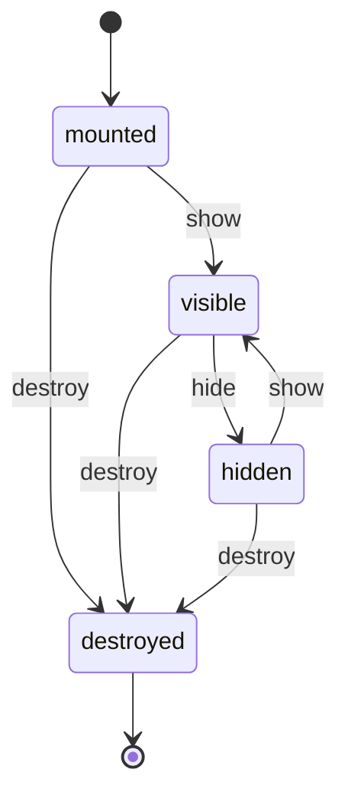
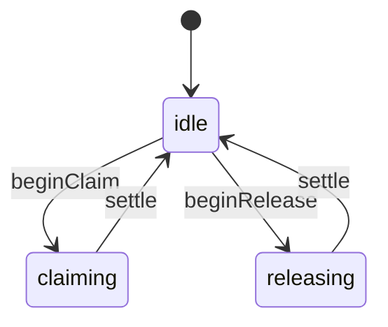
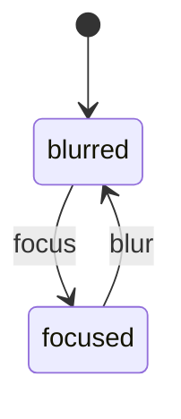

# windease

Browser-based window manager. One package, two entry points: a
framework-agnostic core (`windease`) and React bindings (`windease/react`).

```sh
npm install windease
```

React bindings peer-depend on `react@^19` (declared optional — install only
if you import from `windease/react`).

> **Playground:** every strategy and DnD path lives in the Ladle playground
> at <https://orochi235.github.io/windease/>.
>
> **API reference:** TypeDoc-generated reference at
> <https://orochi235.github.io/windease/api/>.

See [`docs/concepts.md`](docs/concepts.md) for the canonical vocabulary
(what's a window vs. zone vs. workspace, which of the four state buckets
owns what, and how reserved keys like `pinned` / `locked` interact with
layout and DnD).

- **Node + capabilities, not classes.** Every node optionally carries
  `container` / `slot` / `focus` / `lifecycle`. The core enforces only
  structural invariants (no cycles, single focus, bidirectional links).
  `Panel` / `Group` / `Zone` are convention names with shipped presets,
  not built-in types.
- **Recursive containers** — any node with a `container` capability hosts
  children, and a child may itself be a container. "Tray inside a window"
  is just a panel whose `container` is set.
- **Universal lifecycle.** Every node carries an FSM
  (`mounted → visible ↔ hidden → destroyed`); panels additionally carry
  `transit` (atomic moves) and `focus` (single-focus invariant).
- **Record replacement.** Every store mutation produces a fresh `Node`
  reference; React's `useSyncExternalStore` invalidates correctly by
  default.
- **JSON-safe snapshots** via `serialize(store)` / `deserialize(snap)`.
- **Layout strategies** are pure functions. Built-ins: `gridStrategy`,
  `stackStrategy`, `stripStrategy`, `splitStrategy` (binary by default,
  recursive when `recursive: true` in config). Strategies work unchanged
  on recursive trees via the `LayoutNode` adapter.

## Quick start

```bash
npm install windease
```

```tsx
import { gridStrategy } from 'windease';
import {
  Provider,
  StrategyRegistryProvider,
  Zone,
  Panel,
} from 'windease/react';

export function App() {
  return (
    <Provider>
      <StrategyRegistryProvider strategies={{ grid: gridStrategy }}>
        <Zone
          id="root"
          strategyId="grid"
          config={{ cols: 2 }}
          viewport={{ w: 720, h: 480 }}
        >
          <Panel id="a" meta={{ title: 'A' }} />
          <Panel id="b" meta={{ title: 'B' }} order={10} />
        </Zone>
      </StrategyRegistryProvider>
    </Provider>
  );
}
```

`<Panel>` / `<Group>` / `<Zone>` register themselves with the underlying
store on mount and unregister on unmount. JSX is the source of truth for
the shape of the tree.

Import the baseline stylesheet once at the top of your app:

```ts
import 'windease/styles.css';
```

It supplies the structural rules `.windease-zone`, `.windease-window`, and
the insertion-line affordance default. All visual styling is yours.

### Imperative API (advanced / dynamic trees)

For server-loaded layouts, programmatically generated nodes, or anything
that can't be expressed as static JSX, use the store directly:

```tsx
import { Store, createPanel, asNodeId } from 'windease';

const store = new Store();
store.registerNode(createPanel({ id: asNodeId('p1'), parentId: asNodeId('root') }));

<Provider store={store}>{/* ... */}</Provider>
```

Imperative and declarative nodes coexist under the same parent. JSX-owned
ids reconcile their props on every render; imperative ids retain whatever
the caller set. See `docs/concepts.md` for the ownership model.

## State machines

Every node carries up to three FSMs, all defined in `src/machines/` and run
through a tiny `Machine<State, Event>` runtime in `src/fsm.ts`. Snapshots
serialize the current state name; deserialize rebuilds a fresh machine
in that state.

**Lifecycle** (every node). Drives `node.lifecycle.state`. `show` / `hide`
are idempotent on their target state; `destroy` is terminal.



**Transit** (slotted nodes during `moveNode`). Provides an atomic
release-then-claim envelope around reparenting so transition listeners
can stage CSS/animation around the move. `settle` returns to `idle`.



**Focus** (nodes that opt into the focus capability). Enforces the
single-focus invariant per store: focusing one node automatically blurs
the previous focus holder.



## Drag and drop

DnD is opt-in. Wrap your panel chrome in `<DragHandle>`, register each
container as a drop target with `useDropTarget(zoneId, ref)`, and put
the tree under `<DragProvider>`. The drag controller honors:

- `slot.placement.locked` — per-child drag suppression.
- `container.allowsDragOut` — zone-level drag suppression.
- `container.allowsDrop` — zone-level drop refusal.
- The destination strategy's `canAccept(prospective-items, options)` — e.g.
  `splitStrategy` with `recursive: false` refuses anything that wouldn't
  leave exactly two children.
- An optional consumer-supplied `canAccept(sourceId)` on the drop target.

See the **Parallel zones / Drag between** story for the canonical setup.

## Resize

Pass `affordances` to `<Container>` to render the strategy's interactive
gutters. `splitStrategy` ships draggable gutters out of the box (binary
by default; pass `recursive: true` for arbitrary trees). State persists
on `node.container.state` and survives snapshot/hydrate. Per-child
`hints.minSize` is honored as a pixel floor so manual gutter drags can't
push a panel below its declared minimum. The default 4px gutter ships
with an 8px-wide hit area (`affordanceHitPad`).

## Develop

```bash
npm install
npm test
npm run build
npm run lint
npm run ladle    # opens the playground at http://localhost:61000/
```

Design / planning docs live under `docs/superpowers/`. Canonical reference:
[`docs/concepts.md`](docs/concepts.md).
