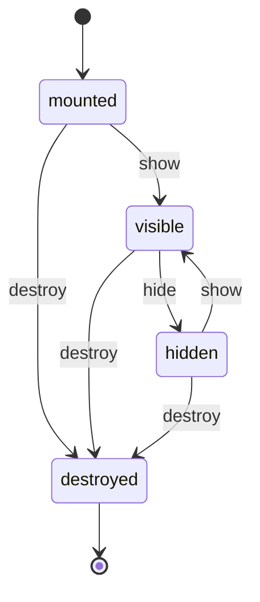
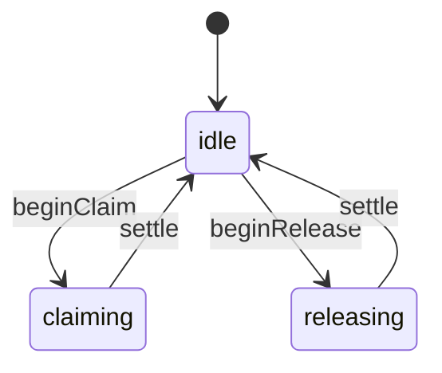
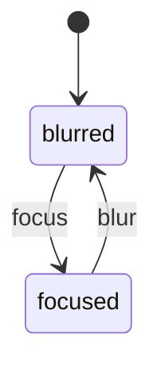

# windease

Browser-based window manager. One package, two entry points: a
framework-agnostic core (`windease`) and React bindings (`windease/react`).

```sh
npm install windease
```

React bindings peer-depend on `react@^19` (declared optional — install only
if you import from `windease/react`).

> **Playground:** every strategy and DnD path lives in the Ladle playground
> at <https://orochi235.github.io/windease/>.
>
> **API reference:** TypeDoc-generated reference at
> <https://orochi235.github.io/windease/api/>.

See [`docs/concepts.md`](docs/concepts.md) for the canonical vocabulary
(the capability model, which of the four state buckets owns what, how
`node.lock` restricts operations, and how reserved keys like `pinned` /
`size` interact with layout and DnD).

- **Node + capabilities, not classes.** Every node carries `lifecycle` and
  optionally `container` / `membership` / `focus`, all built by one
  constructor, `createNode`. The core enforces only structural invariants (no
  cycles, single focus, bidirectional links). `Panel` / `Zone` are convention
  names with shipped React presets, not built-in types; `Group` is the same
  shape reached via `createNode({ container, parentId })` and
  `<Zone parentId kind="group">`, not a separate preset.
- **Recursive containers** — any node with a `container` capability hosts
  children, and a child may itself be a container. "Tray inside a window"
  is just a panel whose `container` is set.
- **Universal lifecycle.** Every node carries an FSM
  (`mounted → visible ↔ hidden → destroyed`); panels additionally carry
  `transit` (atomic moves) and `focus` (single-focus invariant).
- **Record replacement.** Every store mutation produces a fresh `Node`
  reference; React's `useSyncExternalStore` invalidates correctly by
  default.
- **JSON-safe snapshots** via `serialize(store)` / `deserialize(snap)`.
- **Layout strategies** are pure functions. Built-ins: `gridStrategy` and
  `stripStrategy` (main-axis stack with capacity handling; `{ axis: 'y' }`
  is what "stack" was). Strategies work unchanged on recursive trees via the
  `LayoutNode` adapter. `store.split(id, input)` builds nested `stripStrategy`
  trees without a dedicated strategy of its own.

## Quick start

```bash
npm install windease
```

```tsx
import { gridStrategy } from 'windease';
import {
  Provider,
  StrategyRegistryProvider,
  Zone,
  Panel,
} from 'windease/react';

export function App() {
  return (
    <Provider>
      <StrategyRegistryProvider strategies={{ grid: gridStrategy }}>
        <Zone
          id="root"
          strategyId="grid"
          config={{ cols: 2 }}
          viewport={{ w: 720, h: 480 }}
        >
          <Panel id="a" meta={{ title: 'A' }} />
          <Panel id="b" meta={{ title: 'B' }} order={10} />
        </Zone>
      </StrategyRegistryProvider>
    </Provider>
  );
}
```

`<Panel>` / `<Zone>` register themselves with the underlying store on mount
and unregister on unmount. JSX is the source of truth for the shape of the
tree.

Import the baseline stylesheet once at the top of your app:

```ts
import 'windease/styles.css';
```

It supplies the structural rules `.windease-zone`, `.windease-window`, and
the insertion-line affordance default. All visual styling is yours.

### Imperative API (advanced / dynamic trees)

For server-loaded layouts, programmatically generated nodes, or anything
that can't be expressed as static JSX, use the store directly:

```tsx
import { Store, createNode, asNodeId } from 'windease';

const store = new Store();
store.registerNode(createNode({ id: asNodeId('p1'), parentId: asNodeId('root'), focus: true }));

<Provider store={store}>{/* ... */}</Provider>
```

Imperative and declarative nodes coexist under the same parent. JSX-owned
ids reconcile their props on every render; imperative ids retain whatever
the caller set. See `docs/concepts.md` for the ownership model.

## State machines

Every node carries up to three FSMs, all defined in `src/machines/` and run
through a tiny `Machine<State, Event>` runtime in `src/fsm.ts`. Snapshots
serialize the current state name; deserialize rebuilds a fresh machine
in that state.

**Lifecycle** (every node). Drives `node.lifecycle.state`. `show` / `hide`
are idempotent on their target state; `destroy` is terminal.


```mermaid
stateDiagram-v2
    [*] --> mounted
    mounted --> visible: show
    mounted --> destroyed: destroy
    visible --> hidden: hide
    hidden --> visible: show
    visible --> destroyed: destroy
    hidden --> destroyed: destroy
    destroyed --> [*]
```

**Transit** (parented nodes during `moveNode`). Provides an atomic
release-then-claim envelope around reparenting so transition listeners
can stage CSS/animation around the move. `settle` returns to `idle`.


```mermaid
stateDiagram-v2
    [*] --> idle
    idle --> claiming: beginClaim
    idle --> releasing: beginRelease
    claiming --> idle: settle
    releasing --> idle: settle
```

**Focus** (nodes that opt into the focus capability). Enforces the
single-focus invariant per store: focusing one node automatically blurs
the previous focus holder.


```mermaid
stateDiagram-v2
    [*] --> blurred
    blurred --> focused: focus
    focused --> blurred: blur
```

## Who owns child order

`<Zone>` reconciles its children's order from JSX child order on every render.
That is what you want when the declared order *is* the truth, and wrong when
the user rearranges things — a drop is reverted by the host's next render.

Pass `preserveStoreOrder` to make declared order *initial* rather than
authoritative:

```tsx
import { preserveStoreOrder } from 'windease/react';

<Zone id={zoneId} sort={preserveStoreOrder}>
  {workspaces.map((w) => (
    <Panel key={w.id} id={w.id} />
  ))}
</Zone>
```

The host still decides which children exist; the store decides how they are
arranged. Reconcile short-circuits, so no `setChildOrder` runs — you do not
need an `arrange` lock, and you do not need to echo `node.reordered` back into
your own state to keep the two in sync.

Write your own `ChildSort` for anything in between: it receives the observed
children with their `order` hints plus the current store order, and returns the
final list.

## Drag and drop

DnD is opt-in. Wrap your panel chrome in `<DragHandle>`, register each
container as a drop target with `useDropTarget(zoneId, ref)`, and put
the tree under `<DragProvider>`. The drag controller honors:

- `lock.move` on the source — per-node drag suppression.
- `lock.dragOut` on the source's parent — zone-level drag suppression.
- `lock.accept` on the target — zone-level drop refusal.
- The destination strategy's `canAccept(prospective-items, options)` — e.g.
  a strategy with a `maxItems` config refusing a drop that would overflow it.
- An optional consumer-supplied `canAccept(sourceId)` on the drop target.

See the **Parallel zones / Drag between** story for the canonical setup.

## Resize

Pass `affordances` to `<Container>` to render `stripStrategy`'s interactive
gutters — `resize-x-<childId>` / `resize-y-<childId>`, one after every
non-last child. Dragging one writes an explicit pixel size straight to
`membership.placement.size`, which round-trips through snapshot/hydrate as an
ordinary node field — no separate strategy state. Per-child `hints.minSize`
is honored as a pixel floor so manual gutter drags can't push a panel below
its declared minimum, and `hints.maxSize` as a ceiling so a pane can't grow
past it (on initial layout, explicit sizing, and gutter drags). The default
4px gutter ships with an 8px-wide hit area (`affordanceHitPad`).

To pin a pane to a fixed pixel extent along strip's main axis, set
`placement.size` via `store.patchPlacement(id, { size: { w } })` (or `{ h }`);
siblings without an explicit size of their own share the remainder. Combine
with `hints.maxSize` for an "auto up to a cap" pane. `store.split(id, input)`
builds the nested `stripStrategy` groups a multi-pane layout needs; see
`docs/concepts.md`.

## Optional transition throttling

Consumers driving the store from a live event stream can rate-limit how
fast the layout reacts. All of it is opt-in — omit `throttle` and the
store behaves exactly as it always has.

```ts
const store = new Store({
  throttle: {
    notifyMs: 32,                     // coalesce bursts into one flush
    dwell: { lifecycle: 150 },        // min quiet time before a state publishes
    stagger: { batch: 8, ms: 40 },    // publish mass transitions in waves
  },
});
```

Throttling gates **observation, never truth**. `getNode()` returns the
published view that subscribers and the React layer see; `getNodeTruth()`,
`nodesTruth`, `rootIdsTruth`, and `focusedIdTruth` return the exact current
state. Snapshot and history always read truth, so persistence and undo are
unaffected. `store.flushNow()` publishes everything pending immediately,
bypassing `notifyMs`, `dwell`, and `stagger` alike.

`notifyMs` coalesces bursts into one flush per window. `dwell` is a
debounce, not a leading-edge throttle: a node publishes once it has been
quiet for `dwellMs`, or when `maxWaitMs` has elapsed since it first went
dirty — the starvation cap that stops a permanently-noisy node from never
updating (defaults to 4x the largest configured dwell). Only an FSM
transition on a configured machine starts or restarts a dwell; ordinary
field writes (activity, placement, meta) never gate on it. `stagger`
publishes at most `batch` newly-eligible nodes per `ms`-spaced wave,
oldest-dirty-first, so a mass transition (e.g. a cold-start flood) animates
in deterministic batches instead of all at once.

### Introspecting what's withheld

`store.getPending(id)` answers "why hasn't this node published yet?":

```ts
const pending = store.getPending(nodeId);
// null if nothing is withheld for this id (always null on a
// store with no `throttle` policy)
if (pending) {
  const { since, touched, dwellMs, machine, bypass, coalesced, eligibleAt } = pending;
  // ...
}
```

`eligibleAt` is when the dwell/`maxWaitMs` gate *opens*, not when the node
will actually publish — `notifyMs` coalescing and stagger waves can both
defer the real flush past it. `coalesced` counts internal dirty-marks, not
store operations — it's a churn indicator, not a change tally.

Two paired events on `store.events` mark the same episode's edges:

```ts
store.events.on('throttle.pending', ({ id, since }) => { ... });
store.events.on('throttle.published', ({ id, heldMs, coalesced, forced }) => { ... });
```

Here too, `coalesced` is the number of internal dirty-marks folded into
this publish, not a count of store operations.

`throttle.pending` fires when a node first goes dirty, before the dwell
gate has settled, so it carries no `dwellMs`/`eligibleAt` — read
`getPending` for those. Exactly one `throttle.published` follows each
`throttle.pending` for the same id, including a node unregistered while
pending or dropped by `deserialize`, so a consumer maintaining a
`Set<NodeId>` of withheld nodes is correct at every point, not merely
balanced at the end.

Set `WINDEASE_TRACE=throttle` to see publish decisions.

A nonsensical policy (a negative or `NaN` `notifyMs`/`dwell`/`maxWaitMs`, a
`stagger.batch` below 1, or a negative `stagger.ms`) throws
`InvalidThrottlePolicyError` when the store is constructed, rather than
silently misbehaving. `notifyMs: 0` and `maxWaitMs: 0` are legal, meaningful
values, not omissions.

### Hydrating in place

`deserialize(snap)` builds a brand-new `Store` with default options — handy
for a one-shot load, but it drops whatever `throttle` policy you configured
and leaves existing subscribers pointed at the old instance. To rehydrate
an existing store instead (preserving its throttle policy and subscribers),
pass the store as the first argument:

```ts
deserialize(store, snap);
```

This clears the target in place before repopulating it, emitting
`node.unregistered` / `node.cascadeDestroyed` for whatever was there
before the snapshot lands.

## Breaking changes

### 1.0.1

`createZone` and `createPanel` are collapsed into one constructor,
`createNode`. The split was arbitrary: a zone with a `parentId` was already
what the removed `createGroup` built, and a panel with a `container` was
already the documented recursive-panel case. `container`, `membership` (via
`parentId`), and `focus` are now independent opt-in fields on one input.

| Removed | Use instead |
|---|---|
| `createZone`, `CreateZoneInput` | `createNode` |
| `createPanel`, `CreatePanelInput` | `createNode` |

Two mechanical rewrites cover every call site:

```ts
// createPanel({ id, parentId, ...rest }) →
createNode({ id, parentId, focus: true, ...rest });

// createZone({ id, strategyId, config, allowsPinning, ...rest }) →
createNode({ id, container: { strategyId, config, allowsPinning }, ...rest });
```

`<Zone>` and `<Panel>` are unchanged — they're React presets over
`createNode` now, but their props and behavior are the same.

### 1.0.0

Breaking. Three exports are removed; each has a direct replacement.

| Removed | Use instead |
|---|---|
| `splitStrategy` (+ `SplitNode`, `SplitOptions`, `SplitMeta`) | `store.split(id, input)` |
| `stackStrategy` | `stripStrategy` with `{ axis: 'y', fill: true }` |
| `createGroup`, `<Group>` | `createZone({ parentId })`, `<Zone parentId kind="group">` |

- **`store.split(id, input)` / `store.unsplit(groupId)`.** Split is a verb over
  the node tree rather than a strategy holding its own tree, so registering a
  child, removing one, and dragging one all behave — they are ordinary store
  mutations now. Directions are `'x'`, `'y'`, `'both'` and `'grid'`; all ids are
  caller-supplied.
- **`store.transact(fn, label?)`** emits `transaction.begin` /
  `transaction.end`. Bracket history pushes on that pair to get one undo step
  per composite operation — the `node.*` events are per-mutation and would give
  you one entry per node touched.
- **Snapshots are v5.** A v4 snapshot using `splitStrategy` migrates on read:
  its `SplitNode` tree becomes real nested strip groups. Pane *ratios* do not
  survive — strip derives extents from `placement.size` and hints, and a ratio
  has no equivalent — so a migrated layout comes back evenly divided.
- **Migrating `stackStrategy` requires the `fill: true`.** Strip's default is
  off, which sizes a child with no `preferredSize` to zero. That difference
  between the two strategies is why they were folded together.

### 0.9.0 — `node.lock` added, `pinned` redefined

`node.lock` is a new node-intrinsic `LockSet` restricting what may be done to
a node — see `docs/concepts.md` for the axis table. `membership.placement.pinned`
changes from a boolean (promote to the front of `childOrder`) to a number
(hold that exact index).

- `setAllowsDrop` / `setAllowsDragOut` are removed. Use
  `store.setLock(id, { accept: true })` and `{ dragOut: true }`.
- `membership.placement.locked` is no longer read. Use `store.setLock(id, ...)`,
  which is node-intrinsic and survives `moveNode`.
- `membership.placement.pinned` is a number (the held index), not a boolean,
  and can no longer be written through `patchPlacement` / `setPlacement` —
  both throw. Use `store.setPinned(id, at?)` / `store.unpin(id)`.
- Locking no longer reorders. Previously `locked` implied promotion to the
  front of the parent's `childOrder`; a locked node now stays exactly where
  it is.
- `container.allowsDropChanged` / `container.allowsDragOutChanged` are
  replaced by `node.lockChanged` and `node.pinnedChanged`.
- Snapshots are v4. `deserialize` still accepts v2 and v3 and migrates on
  read.

### 0.9.0 — `slot` renamed to `membership`

The parent-membership capability is now `node.membership`, not `node.slot`.
"Slot" was borrowed from web components, where a slot is a hole the *parent*
exposes; here the capability hangs on the *child* and means "the position I
occupy in my parent," so the direction was inverted from what the word
implies everywhere else. `membership` is the word `docs/concepts.md` already
used in prose to describe the lifetime rule.

| Before | After |
| --- | --- |
| `node.slot` | `node.membership` |
| `SlotCap` | `MembershipCap` |
| `store.isSlotted(id)` | `store.isMember(id)` |
| `CapabilityMissingError.capability === 'slot'` | `=== 'membership'` |
| `InvariantViolationError` code `move-unslotted` | `move-unparented` |
| `InvariantViolationError` code `reorder-unslotted` | `reorder-unparented` |

**Snapshots migrate automatically.** `serialize()` now emits `version: 3`
with a `membership` key. `deserialize()` still accepts `version: 2`
snapshots and maps the old `slot` key across on read, so persisted state
from 0.8.0 and earlier keeps loading. Only the write side changed; there is
no migration step to run.

## Develop

```bash
npm install
npm test
npm run build
npm run lint
npm run ladle    # opens the playground at http://localhost:61000/
```

Design / planning docs live under `docs/superpowers/`. Canonical reference:
[`docs/concepts.md`](docs/concepts.md).
