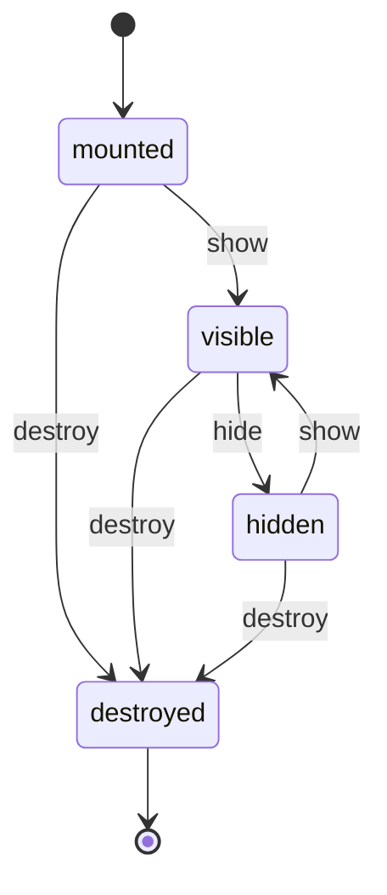
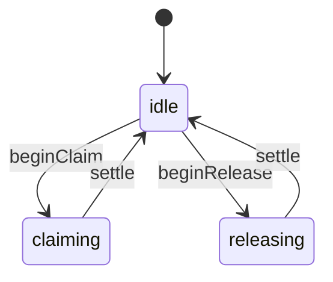
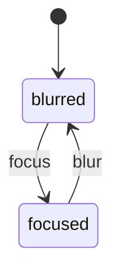

# windease

Browser-based window manager. One package, three entry points: a
framework-agnostic core (`windease`), React bindings (`windease/react`), and a
corpus of layouts lifted from real software (`windease/nuts`).

```sh
npm install windease
```

React bindings peer-depend on `react@^19` (declared optional — install only
if you import from `windease/react`).

> **Playground:** every strategy and DnD path lives in the Ladle playground
> at <https://orochi235.github.io/windease/>.
>
> **API reference:** TypeDoc-generated reference at
> <https://orochi235.github.io/windease/api/>.

See [`docs/concepts.md`](docs/concepts.md) for the canonical vocabulary
(the capability model, which of the four state buckets owns what, how
`node.lock` restricts operations, and how reserved keys like `pinned` /
`size` interact with layout and DnD).

- **Node + capabilities, not classes.** Every node carries `lifecycle` and
  optionally `container` / `membership` / `focus`, all built by one
  constructor, `createNode`. The core enforces only structural invariants (no
  cycles, single focus, bidirectional links). `Panel` / `Zone` are convention
  names with shipped React presets, not built-in types; `Group` is the same
  shape reached via `createNode({ container, parentId })` and
  `<Zone parentId kind="group">`, not a separate preset.
- **Recursive containers** — any node with a `container` capability hosts
  children, and a child may itself be a container. "Tray inside a window"
  is just a panel whose `container` is set.
- **Universal lifecycle.** Every node carries an FSM
  (`mounted → visible ↔ hidden → destroyed`). A node with a parent also carries
  `transit` (atomic moves) — a nested zone as much as a leaf. `focus`
  (single-focus invariant) is opt-in per node via `createNode({ focus: true })`,
  which is what `<Panel>` passes and `<Zone>` does not.
- **Record replacement.** Every store mutation produces a fresh `Node`
  reference; React's `useSyncExternalStore` invalidates correctly by
  default.
- **JSON-safe snapshots** via `serialize(store)` / `deserialize(snap)`.
- **Layout strategies** are pure functions. The built-ins: `stripStrategy`
  (children share one axis, with capacity handling), `gridStrategy`,
  `stackStrategy` (one child visible, you draw the tab strip),
  `floatingStrategy(inner?)`, which wraps another strategy so items marked
  `floating` sit free over what it tiles, `desktopStrategy(inner?)` for
  overlapping, stacked, minimizable windows over an icon layer, three packers — `shelfStrategy`,
  `columnStrategy`, `skylineStrategy` — for boxes of fixed, varied sizes, `justifiedStrategy`
  for photo-gallery rows that keep each item's aspect, and `pageStrategy(inner)`, which shows
  one page of children at a time: virtual desktops, or pagination. Strategies work unchanged on
  recursive trees via the `LayoutNode` adapter. `store.split(id, input)` builds
  nested `stripStrategy` trees without a dedicated strategy of its own.

## Quick start

```bash
npm install windease
```

```tsx
import { gridStrategy } from 'windease';
import {
  Provider,
  StrategyRegistryProvider,
  Zone,
  Panel,
} from 'windease/react';

export function App() {
  return (
    <Provider>
      <StrategyRegistryProvider strategies={{ grid: gridStrategy }}>
        <Zone
          id="root"
          strategyId="grid"
          config={{ cols: 2 }}
          viewport={{ w: 720, h: 480 }}
        >
          <Panel id="a" meta={{ title: 'A' }} />
          <Panel id="b" meta={{ title: 'B' }} order={10} />
        </Zone>
      </StrategyRegistryProvider>
    </Provider>
  );
}
```

`<Panel>` / `<Zone>` register themselves with the underlying store on mount
and unregister on unmount. JSX is the source of truth for the shape of the
tree.

Import the baseline stylesheet once at the top of your app:

```ts
import 'windease/styles.css';
```

It supplies the structural rules `.windease-zone`, `.windease-window`, and
the insertion-line affordance default. All visual styling is yours.

### Imperative API (advanced / dynamic trees)

For server-loaded layouts, programmatically generated nodes, or anything
that can't be expressed as static JSX, use the store directly:

```tsx
import { Store, createNode, asNodeId } from 'windease';

const store = new Store();
store.registerNode(createNode({ id: asNodeId('p1'), parentId: asNodeId('root'), focus: true }));

<Provider store={store}>{/* ... */}</Provider>
```

Imperative and declarative nodes coexist under the same parent. JSX-owned
ids reconcile their props on every render; imperative ids retain whatever
the caller set. See `docs/concepts.md` for the ownership model.

## State machines

Every node carries up to three FSMs, all defined in `src/machines/` and run
through a tiny `Machine<State, Event>` runtime in `src/fsm.ts`. Snapshots
serialize the current state name; deserialize rebuilds a fresh machine
in that state.

**Lifecycle** (every node). Drives `node.lifecycle.state`. `show` / `hide`
are idempotent on their target state; `destroy` is terminal.


```mermaid
stateDiagram-v2
    [*] --> mounted
    mounted --> visible: show
    mounted --> destroyed: destroy
    visible --> hidden: hide
    hidden --> visible: show
    visible --> destroyed: destroy
    hidden --> destroyed: destroy
    destroyed --> [*]
```

**Transit** (parented nodes during `moveNode`). Provides an atomic
release-then-claim envelope around reparenting so transition listeners
can stage CSS/animation around the move. `settle` returns to `idle`.


```mermaid
stateDiagram-v2
    [*] --> idle
    idle --> claiming: beginClaim
    idle --> releasing: beginRelease
    claiming --> idle: settle
    releasing --> idle: settle
```

**Focus** (nodes that opt into the focus capability). Enforces the
single-focus invariant per store: focusing one node automatically blurs
the previous focus holder.


```mermaid
stateDiagram-v2
    [*] --> blurred
    blurred --> focused: focus
    focused --> blurred: blur
```

## Replacing the built-in rules

Three of the library's decisions are replaceable policies, and share one
contract: return a value to choose it, `null` or `false` to refuse
deliberately, `undefined` to defer to the built-in. A policy that throws, or
answers with something the library cannot use, is traced and treated as
`undefined` — a bad policy degrades to the built-in rather than breaking the
gesture.

- [`new Store({ chooseSuccessor })`](#moving-a-pane-without-a-pointer) — who
  takes focus when the focused pane is destroyed or hidden.
- [`new Store({ resolveNavigation })`](#moving-a-pane-without-a-pointer) — how
  a direction or intent resolves to a pane.
- [`<Container acceptPolicy>`](#drag-and-drop) — whether a container takes a
  drop. The same prop is on `<Zone>` and `<Panel>`.

[`<Container edgeScroll>`](#telling-windease-where-the-scroll-got-to) is
adjacent but not a policy: a tuning bag for the auto-scroll ramp, with nothing
to refuse and nothing to defer to.

## Who owns child order

`<Zone>` reconciles its children's order from JSX child order on every render.
That is what you want when the declared order *is* the truth, and wrong when
the user rearranges things — a drop is reverted by the host's next render.

Pass `preserveStoreOrder` to make declared order *initial* rather than
authoritative:

```tsx
import { preserveStoreOrder } from 'windease/react';

<Zone id={zoneId} sort={preserveStoreOrder}>
  {workspaces.map((w) => (
    <Panel key={w.id} id={w.id} />
  ))}
</Zone>
```

The host still decides which children exist; the store decides how they are
arranged. Reconcile short-circuits, so no `setChildOrder` runs — you do not
need an `arrange` lock, and you do not need to echo `node.reordered` back into
your own state to keep the two in sync.

Write your own `ChildSort` for anything in between: it receives the observed
children with their `order` hints plus the current store order, and returns the
final list.

### When the host owns order outright

`preserveStoreOrder` keeps a drop without telling you about it. If your own
store is the authority — an app that already persists a workspace list and its
order — pass `onChildOrderChange` instead. A drop then calls you with the order
it *would* have produced and writes nothing:

```tsx
<Container
  parentId={zoneId}
  chrome={chrome}
  onChildOrderChange={(next, { movedId, fromParentId, toParentId }) => {
    myStore.setWorkspaceOrder(next); // your state, your persistence
  }}
/>
```

Commit it and re-render; the binding reconciles to whatever you declare next.
Two things to know:

- **Controlled means the store is not written at all.** If either side of a
  cross-parent drop is controlled, `moveNode` does not run and each controlled
  parent gets its own call. Moving the record — including into an uncontrolled
  zone — is yours, because committing here *and* asking you to commit would
  apply one gesture twice.
- **Only library-mediated gestures are intercepted.** `store.reorderInParent`
  and `store.moveNode` called directly still commit; that is you acting on your
  own store, not a user gesture to approve.

## Moving several panes at once

`store.moveNodes(ids, toParentId, at?)` moves a set of nodes into one parent as
a single operation — a multi-select, a "send these to the dock" command,
anything with more than one pane in hand.

```ts
store.moveNodes(selection, dockId, 0);
```

A `moveNode` loop is not the same thing, and the differences only surface on
trees that already carry pins, locks or `autoUnsplit`:

- **One insertion point.** `at` is resolved once and the set lands as a run in
  source order. A loop passing the same `at` inserts each node ahead of the
  last and reverses the run; incrementing `at` by hand breaks as soon as the
  destination holds a pin.
- **Nothing moves until everything validates.** Every `move`, `accept` and
  `dragOut` lock is checked before the first mutation. A loop that meets a
  locked node halfway throws with the earlier nodes already moved —
  `store.transact` brackets events, it does not roll back.
- **The source settles once, at the end.** An `autoUnsplit` container is judged
  on the state after the whole batch, so it cannot dissolve out from under the
  rest of the run.
- **One undo step.** The batch is bracketed in a `transaction.begin` /
  `transaction.end` pair labeled `moveNodes`, and notifies once.

Repeated ids are dropped, and a node whose ancestor is also in the set is
dropped with it — moving the ancestor takes it along. A node already under
`toParentId` is repositioned into the run and reports `node.reordered` rather
than `node.moved`. Everything else emits per node exactly as `moveNode` does,
and `placement` carries across the move.

## Sizing a pane to its contents

Declare it per axis and the library measures for you:

```tsx
store.registerNode(
  createNode({ kind: 'palette', id, parentId: dockId, hints: { sizing: { h: 'content' } } }),
);
```

The presets take the same thing as a prop — `<Panel hints={{ sizing: { h: 'content' } }} />`
— reconciled on change like `meta`.

`<Container>` and the presets wrap a content-sized pane's children in an
auto-height div and observe it, so the measurement is of the content rather than of the extent the
layout just wrote — measuring the positioned wrapper would measure the library's
own output and never settle. Give that div's contents a real intrinsic height:
a child stretched with `height: 100%` reports the pane, not the content.

A measurement is a stated size like any other. It scales under pressure, it is
capped by `hints.maxSize`, and it loses to `placement.size` — so **dragging a
gutter pins the pane** and it stops tracking its contents. Clear the size to
resume:

```tsx
store.patchPlacement(id, { size: { h: undefined } });
```

Unlike a size you write, a measurement *is* floored at `hints.minSize`: the
exemption that makes the collapse pattern below work exists for deliberate
intent, and a measurement states none.

Without React, report measurements yourself — `hints.sizing` is honored by the
strategy either way:

```ts
host.setNaturalSize(id, { w, h }); // or host.observeNatural(id, el)
```

### Sizing a grid to its rows

`hints.sizing` sizes a pane to what is inside it. A host that instead wants the
*grid itself* to be as tall as the rows it produced needs the row count, and a
grid derives its whole tiling — columns, rows, which item is in which cell —
from the item count, their spans and the config, without reading the container
at all. `gridTiling` reports it:

```ts
const { cols, rows } = gridTiling(items, config);
const height = rows * MY_ROW_HEIGHT + gap * (rows - 1);
```

It takes no container and lays nothing out. Empty `items` tiles to `0 x 0`, so
the height comes out zero rather than one empty row.

Grid reports counts and not an extent because it has no opinion about how tall
a row should be — pick that yourself, usually from `cols` and the width you
already know. A config `layout` would reject is rejected here too, rather than
answered with a tiling nothing will render.

## Collapsing a pane

There is no collapse state. A collapsed pane is a sized pane: write
`placement.size` down to your header extent, and write it back to expand.

```tsx
const HEADER = 32;

const collapse = (id: NodeId) =>
  store.transact(() => {
    const h = (store.getNode(id)?.membership?.placement?.size as { h?: number })?.h;
    store.setMeta(id, { expandedH: h });
    store.patchPlacement(id, { size: { h: HEADER } });
  }, 'collapse');

const expand = (id: NodeId) =>
  store.transact(() => {
    const h = store.getNode(id)?.meta?.expandedH as number | undefined;
    store.patchPlacement(id, { size: { h } });
    store.setMeta(id, { expandedH: undefined });
  }, 'expand');
```

`transact` makes each one a single undo step, and `meta` round-trips through
`serialize`, so a collapsed layout survives save and reload.

`hints.minSize` does not block this. It floors a pane that states no size of
its own, and it still stops a gutter drag from crossing it — but a size you
write is taken as intent and rendered as written. So a palette can declare a
120px minimum for its expanded state and still collapse to a 32px header.

Two things the pattern owes its users: keep the collapsed pane's accessible
name, and keep its expand control reachable from the keyboard in whatever
still renders. A pane that can be collapsed and not reopened without a mouse
is worse than one that never collapsed.

## Collapsing a group that empties out

A group that started with two panes and lost one is a wrapper around nothing:
one child, one extra layout level, one extra level of nesting in every
snapshot. `store.setAutoUnsplit(groupId, true)` collapses it when that
happens — the survivor is lifted into the grandparent at the group's index,
inheriting the group's placement and pinned position, and the group is
destroyed.

```ts
store.setAutoUnsplit(groupId, true);
store.unregisterNode(paneA); // paneB takes the group's place; the group is gone
```

Opt-in per container, because a zone you created on purpose has to survive
being emptied — the trigger cannot live in `unregisterNode` itself. It fires
only on the transition, not on any container that happens to hold one child,
so you can still build a group up a pane at a time. A root never collapses:
there is no grandparent to lift into. And a `destroy` or `dragOut` lock on the
group, or `arrange` on its parent, quietly leaves the tree alone rather than
failing the removal that triggered it.

It does not cascade, and does not need to: lifting the survivor swaps it for
the group in the grandparent, so the grandparent's child count is unchanged.

Removals are now bracketed in a transaction so the collapse is one undo step
with the removal that caused it. If you bracket history on `transaction.begin`
/ `transaction.end`, every `unregisterNode` emits that pair, collapse or not.

## When panes leave room

Panes held at a `hints.maxSize` cap, or sized by `preferredSize` under
`fill: false`, can leave part of a strip empty — three browser tabs at their
225px cap, say. `justify` on the zone's config says where that space goes:

```tsx
<Zone id={tabsId} strategyId="strip" config={{ axis: 'x', fill: true, justify: 'center' }} />
```

`'start'` (default) packs the panes at the leading edge. `'center'` and `'end'`
move the whole row. `'between'` widens the gaps, leaving a lone pane at the
start. It does nothing when the panes fill or overflow the row.

## When panes don't fit

A strip whose panes ask for more than the container has resolves it three ways,
set by `overflowMode` on the zone's config.

`'squeeze'` (default) scales the panes down until their floors bind, then
reports whatever is left over as `LayoutResult.overflow`. This is what the
strategy has always done.

`'scroll'` lays out at the extent the panes asked for and reports the whole
excess. `<Container>` / `<Zone>` / `<Panel>` size their box to
`viewport + overflow`, so all you supply is a wrapper that scrolls:

```tsx
<div className="dock-scroll">           {/* overflow-y: auto */}
  <Zone id={dockId} strategyId="strip" config={{ axis: 'y', overflowMode: 'scroll' }}>
    <Panel id={a} hints={{ sizing: { h: 'content' } }} />
    <Panel id={b} hints={{ sizing: { h: 'content' } }} />
  </Zone>
</div>
```

Content-sized panes are the reason this mode is worth having, and the reason to
be careful with the other one. A measurement is a stated size, so under
`squeeze` a pane with no `hints.minSize` has nothing to floor it: it shrinks
below what it measured and `overflow` stays absent, because nothing bound.
Under `scroll` each pane holds at its measurement.

`'unplaced'` places what fits at full extent and routes the rest to
`LayoutResult.unplaced`, which is also where `maxItems` sends items over its
count cap — the two compose. When even the first pane doesn't fit it is placed
anyway, clamped to the container, so an overflowing dock never renders empty.

`gridStrategy` takes the same three, with one difference in what triggers
them. A grid derives its cells from the container, so it can always divide the
space and only overflows once an item states a `hints.minSize` floor. Under
`'squeeze'` the floors are ignored, as they always were; under `'scroll'` the
cells hold at their floor and the excess is reported; under `'unplaced'` the
rows that fit are kept and the rest go to `unplaced`. A container too narrow
for the floors reports width `overflow` under `'unplaced'` too, since dropping
rows cannot widen a cell.

`overflow` is reported per axis and absent when the content fits, so a consumer
that wants to drive its own policy can read it and ignore all three.

`w` and `h` measure the right and bottom edges. A strategy that places content at
negative coordinates — `desktopStrategy` is the one that does — adds `left` and
`top`. A scroller cannot reach anything before its own origin, so the box gets a
matching `margin-left` / `margin-top`, and a `scrollRef` is scrolled by the same
amount whenever the margin changes, which keeps the origin still on screen: the
content past the edge opens scrolled out of view, one scroll away. The margin
sits outside the box, so the box itself must not clip — the wrapper does.

### Keeping panes in view while the rest scroll

A strip pane whose placement sets `sticky: true` stays at the start of the
row while the others scroll under it, like Firefox's pinned tabs. It only
means anything under `overflowMode: 'scroll'`, and the container needs a
`scrollRef` (below) to know how far it has scrolled:

```tsx
<Zone id={tabsId} strategyId="strip" config={{ axis: 'x', overflowMode: 'scroll' }} scrollRef={scrollRef}>
  <Panel id={mail} placement={{ size: { w: 44 }, sticky: true }} />
  <Panel id={page} placement={{ size: { w: 140 } }} />
</Zone>
```

Sticky panes stack in row order: the second one sticks just after the first.
A sticky pane sits where the row puts it until the scroll reaches it, and its
seam moves with it. It draws above the panes that scroll under it, so give it
an opaque background.

The strategy never sees the scroll offset, so scrolling still doesn't re-run
it. It reports each sticky pane's inset from the visible edge in
`LayoutResult.sticky`, and the container shows the pane at
`stuckRect(rect, inset, scroll)`. `placements` stay unscrolled. A host drawing
its own panes calls `stuckRect` with the offset it passed to `setScroll`.

### Telling windease where the scroll got to

The wrapper is yours, so the scroll offset is something windease has to be
told. Point `scrollRef` at the element that scrolls:

```tsx
const scrollRef = useRef<HTMLDivElement>(null);

<div ref={scrollRef} className="dock-scroll">
  <Container parentId={dockId} chrome={chrome} scrollRef={scrollRef} />
</div>
```

Placements stay unscrolled — the strategy lays out the whole extent and knows
nothing about what is on screen. What the offset changes is the *reported*
position of a pane, which is what directional keyboard navigation compares.
Without it a scrolled container is navigated against positions its panes no
longer occupy, and a scrolled container sitting beside an unscrolled one
disagree about where they both are.

Each container answers for its own offset, so nesting composes: a scrolling
dock inside a scrolling workspace needs a `scrollRef` on each, and the chain
resolves to one space. A flow container needs none — it is measured from the
DOM, which counts scroll already.

`ContainerHost.setScroll({ x, y })` is the headless API underneath, for a
canvas host panning its own surface with no DOM scroll box to read;
`observeScroll(el)` is the DOM convenience over it, mirroring
`setViewport` / `observe`. Scrolling never re-runs the strategy.

The same `scrollRef` gives you auto-scroll: dragging a pane toward the edge of
a scrolling container scrolls it, and keeps scrolling while the cursor is held
there. The rate ramps from zero at 48px out to 16px per frame at the edge, and
holds there past it so overshooting a target does not fight you. Nothing to
turn on — a container with no `scrollRef` never auto-scrolls.

`<Container edgeScroll={{ margin, maxRate }}>` reshapes that ramp — the two
numbers above are its defaults. `<Zone>` and `<Panel container={…}>` take both
props and behave the same way: point `scrollRef` at your wrapper and the ramp
reaches a preset dock too.

`edgeScrollDelta(bounds, point, options)` is the arithmetic on its own, pure
and exported, for a host driving its own drag loop. `DropTargetOptions` takes
the same `edgeScroll` bag.

## Packing boxes of fixed sizes

The strategies above divide a container among their children. `shelfStrategy`,
`columnStrategy` and `skylineStrategy` do the opposite: each item keeps its own
size — `natural` if measured, else `hints.preferredSize` — and the container's
width is the only bound. They pack downward as far as the content goes and
report the height past `container.h` as `overflow`. An item wider than the
container still goes in, at the left edge, and reports width `overflow`. An
item with no size goes to `unplaced`.

- **`shelf`** — rows, left to right, each new row starting below the tallest
  item in the last.
- **`column`** — masonry. Equal columns `columnWidth` wide (default: the
  narrowest item); each item goes on the shortest run of columns its width
  spans. One item much narrower than the rest shrinks every column to its
  width; set `columnWidth` when the mix has one. `cols: 3` fixes the count
  instead and widens the columns to fill the container, as Unsplash's three
  columns do; it cannot be combined with `columnWidth`. When fixed-width
  columns leave some of the width over, `justify: 'center'` or `'end'` moves
  the columns into it, as Pinterest centers its feed.
- **`skyline`** — each item takes the lowest free spot along what is already
  packed, so a short item drops in beside a tall one where `shelf` would leave
  a hole.

All three take `gap`, and place items in the order given unless `sort` says
otherwise. They run headless like any strategy:

```ts
const { placements, overflow } = skylineStrategy.layout({
  items,
  container: { w: 1200, h: 800 },
  state: undefined,
  options: { gap: 8 },
});
```

## Justified rows of photos

`justifiedStrategy` lays items out the way Flickr and Google Photos do. Each
item keeps its shape and gets scaled, and each row is sized so it fills the
container's width exactly. The shape is `hints.aspect` (width ÷ height), else
the width ÷ height of `natural` or `hints.preferredSize`; an item with none of
them goes to `unplaced`.

```ts
createNode({ kind: 'panel', id, parentId: galleryId, hints: { aspect: 3 / 2 } });
// the gallery's config:
{ rowHeight: 180, gap: 4, maxRowHeight: 360, justifyLast: false }
```

- **`rowHeight`** (default 200) is the height rows aim for. The strategy picks
  all the row breaks together, so the rows' heights stray from it as little as
  possible in total, rather than filling each row greedily and leaving one
  awkward row badly stretched.
- **`justifyLast`** — the last row stays at `rowHeight` and ends short of the
  right edge unless this is `true`. A last row too wide to fit at `rowHeight`
  is always scaled down to the width.
- **`maxRowHeight`** — a row that would have to grow taller than this to fill
  the width stays at `rowHeight` and ends short instead, as a lone portrait
  in a wide container would.

Rows grow down past `container.h`, and the excess is reported as `overflow`,
as with the packers. No other built-in strategy reads `hints.aspect`: a strip
stretches its cross axis and a grid fills its cells whatever the item's shape.

### Sorting before packing

`sort: 'height' | 'width' | 'area' | 'max-side'` places the largest first by
that measure; `'none'`, the default, keeps the order given. Items that tie keep
their order. Sorting changes where items land, never which ones are placed,
and `placements` and `unplaced` still list items in the order given.

Sorting usually packs tighter: `shelf` with `sort: 'height'` is the classic
next-fit decreasing height packing, and `'max-side'` is a common choice for
sprite sheets.

### Turning items a quarter

`rotate: true` lets a packer place an item turned 90° when that fits better,
as sprite-sheet packers and pallet loaders do. A turned item's rect has its
width and height swapped, and every placement carries a `rotation` channel —
`90` for turned a quarter clockwise, `0` for upright — so the host knows to
draw its content turned. Read it with `useChannelsForSelf(id)?.rotation`, or
from `result.channels` when calling a strategy directly. Without `rotate`
there is no channel. Squares are never turned.

What "fits better" means differs by packer, and ties always stay upright:

- **`shelf`** turns an item to fit the space left on the current row without
  raising it (the narrower way wins when both do). An item that fits neither
  way goes upright, raising the row, or starts a new one.
- **`skyline`** takes whichever way leaves the item's top edge lower.
- **`column`** takes whichever way spans fewer columns, unless that makes the
  tallest column taller than the other way would.

In all three, an item turns if only turned does it fit the container at all.

### Packing into a fixed box

By default a packer grows downward past `container.h` and reports the excess as
`overflow`, which suits a scrolling feed. `overflowMode: 'unplaced'` makes the
container a bin instead — a sprite sheet of fixed size, or a truck floor. An
item that would cross the bottom or the right edge goes to `unplaced`, even the
first, and packing carries on: a later, smaller item still takes a space an
earlier one could not. Nothing is placed outside the container, so `overflow`
never appears. Hand `unplaced` to the next sheet.

```ts
const { placements, unplaced } = skylineStrategy.layout({
  items: sprites,
  container: { w: 1024, h: 1024 },
  state: undefined,
  options: { sort: 'max-side', overflowMode: 'unplaced' },
});
```

## Putting a grid child at a cell

`gridStrategy` normally flows its children into cells in order. A child whose
placement holds `cell: { col, row }` sits at that cell instead, the way a
Grafana panel sits at its `gridPos` or an element at its place in the periodic
table. The cell is zero-based and names the child's top-left corner; its `span`
still sets how many cells it covers.

```ts
store.patchPlacement(heliumId, { cell: { col: 17, row: 0 } });
```

Celled children reserve their cells first, and the rest flow into the free
cells in order. A grid with no column cap grows wide enough to reach the
furthest cell. A cell that overlaps one already taken goes to `unplaced`, and
so does one outside a capped grid (`cols`, `maxCols`, `rows` or `maxRows`); the
earlier child in `childOrder` keeps a contested cell. A span that would run
past a capped edge is cut short at it. Turn on the `layout` trace to see which
cells were refused and why.

A move or reorder clears `cell`. Both commit a position in `childOrder`, and a
cell would override it, so a dragged celled child would otherwise not move at
all. Dragging one therefore drops it into the flow at the index it lands on.
`setChildOrder` leaves cells alone, since it arranges every child at once.

### Cells of a fixed size

By default a grid divides its container among its cells. `cell: { w, h }` in
the config fixes their size instead, the way an iOS dock's icons stay one size
however wide the dock is. With a fixed `w` and no `cols`, the column count is
however many cells fit across the container, and the items wrap into rows.

```ts
{ strategyId: 'grid', config: { cell: { w: 56, h: 56 }, gap: 12, maxItems: 5 } }
```

Either axis can be fixed alone; the other still divides the container. Rows
past the container's height are reported as `overflow`, or sent to `unplaced`
under `overflowMode: 'unplaced'`. `hints.minSize` floors are not read, since
the size is stated. `canAccept` has no container to fit columns into, so it
cannot refuse a drop by width: set `maxItems` (or `cols` with `maxRows`) when a
drop must be refused. `gridTiling(items, config, container)` takes the
container for the same reason.

### Where leftover width goes

When the occupied columns don't span the container — fixed cells narrower
than it, or trailing columns nothing sits in under `fill: false` or a set
`cols` — `justify` decides where the leftover width goes:

| `justify`         | Leftover width goes                                   |
| ----------------- | ----------------------------------------------------- |
| `'start'` (default) | after the last column                               |
| `'center'`        | half before the first column, half after the last     |
| `'end'`           | before the first column                               |
| `'between'`       | between columns, none at the edges                    |
| `'evenly'`        | into equal spaces between columns and at both edges   |

An iOS dock is `justify: 'evenly'` over fixed cells. Whole columns move, so a
short last row stays aligned under the first, and a span widens by the extra
space between the columns it covers. `justify` is horizontal only, and content
wider than the container stays at the start.

### Tracks of different sizes

Every column of a grid is one width and every row one height, unless `tracks`
says otherwise. It lists sizes by index: a number is pixels, and `{ share: n }`
takes a share of what the pixel tracks and gaps leave, as CSS `fr` does.

```ts
// A row-number column, two fixed columns, two that split the rest, a taller header row.
{ strategyId: 'grid', config: {
  cell: { h: 26 },
  tracks: { cols: [40, 96, 96, { share: 1 }, { share: 1 }], rows: [28] },
} }
```

`tracks.cols` sets the column count when `cols` is unset. `tracks.rows` only
sizes rows: how many there are still comes from the children. A track past the
end of its list takes the fixed `cell` size on that axis, or one share when
there is none. Pixel tracks wider than the container are reported as
`overflow`. `justify` places the width pixel tracks leave; once a share takes
the rest there is none. Under `overflowMode` `'scroll'` or `'unplaced'`, share
tracks are held at the children's `hints.minSize` floors, as uniform cells are.

With `resizable`, a tracked axis gets track seams (see [Grid seams](#grid-seams)).

### Gravity

`compact: 'up'` makes a grid a dashboard: each celled child floats up into the
free rows above it, the way Grafana closes the gap a panel leaves. The rest
flow into what is left. Children go in order of the row their cell states,
then its column, then `childOrder`, and none passes another in the same
column.

Where two cells overlap, the lower one is pushed down beneath the other instead
of going to `unplaced`. So a resize seam can grow a panel into the one below
it, and that one, with everything under it, moves down. Under a row cap
(`rows` or `maxRows`) a child pushed past the last row is `unplaced`, and the
seam stops short of pushing anyone that far. A cell past the last column is
still `unplaced`.

Gravity is a layout rule, not a write: `placement.cell` keeps the row it
states, so turning `compact` off puts every child back.

## Letting CSS do the layout

A container that declares `hints.render: 'flow'` runs no strategy. Its children
render as ordinary in-flow elements and the consumer's own CSS arranges them —
for a host adopting windease into a layout that is already a working CSS grid
and wants the gestures, not the geometry.

```tsx
<Zone id={DOCK} hints={{ render: 'flow' }} className="dock-grid">
  <Panel id="a" />
  <Panel id="b" />
</Zone>
```

```css
.dock-grid {
  display: grid;
  grid-template-columns: repeat(auto-fit, minmax(160px, 1fr));
  gap: 8px;
}
```

`strategyId` is optional on a flow `<Zone>`, since nothing would run it. The
hint outranks a registered strategy: declaring flow on a zone whose `strategyId`
is registered still takes the flow path.

**What still works.** Drag and drop, including the insertion index — the
hit-test measures the DOM and never read placements. Directional keyboard
navigation and `Shift`-arrow moves, because the rects reach the resolver by
measurement instead of from placements, composed into the same coordinate
space as every placed container. Focus, announcements, snapshot and undo are
untouched.

**What a flow container gives up**, all of it downstream of the strategy pass:

| Gone | Because |
| --- | --- |
| `layout.placements` | nothing computes a rect; the map is empty |
| Resize gutters and every other affordance | a strategy emits them |
| `unplaced` overflow and `overflowMode` | capacity is a strategy decision |
| Auto-balance, `cols`/`rows`, `axis`, `gap` | these are CSS now |
| `hints.sizing` content measurement | the measurement feeds a strategy |
| The settle animation | it transitions `left`/`top`, which in-flow panes lack |
| The drag preview's reflow | siblings do not part to show the drop slot |

Mixing modes is the point: keep strategy zones where you want auto-balance or
gutters, and mark the plain tilings flow.

Geometry is re-measured after every render, and between renders whenever a
`ResizeObserver` fires on the container or a pane. A layout shift driven by
neither — CSS alone moving a pane without resizing anything or re-rendering —
is the one case that can leave keyboard navigation reading a stale rect.

The drop axis needs no configuration: a flow container has no strategy to
infer one from, so it reads the axis off the arrangement CSS actually
produced. `config={{ axis: 'x' | 'y' }}` still overrides. `axisFromRects` is
exported for a host doing its own hit-testing.

## Canvas hosts

A host that draws every pane into one canvas — scissor rects on a single WebGL
context, say — positions from placements instead of mounting an element per
node. Two things it needs that a DOM host does not.

`.windease-zone` clips its children. Add `.windease-zone--unclipped` to keep the
positioning and the container queries and drop the `overflow: hidden`, so one
canvas can span the whole zone.

Placements are in CSS pixels, which is most of what a backing store needs — but
a `devicePixelRatio` change means every canvas has to be resized, and dragging a
window between displays is the common case:

```ts
const stop = observePixelRatio((dpr) => resizeBackingStores(dpr));
```

It reports the current ratio immediately and again on every change, so one
handler covers mount and update. A resolution media query embeds the ratio it
was built with, so a listener left on it fires once and is then permanently
false; this re-arms at the new ratio each time.

It is not on `ContainerHost` on purpose: nothing in `layout()` reads the ratio,
and a ratio change and a placement change are independent triggers for the same
resize.

## Pan and zoom

`view={{ x, y, scale }}` on `<Container>` or `<Zone>` draws the laid-out box
moved by `x` / `y` and scaled by `scale` about its top-left — Figma's canvas.
Layout does not change: placements stay in layout pixels, and what moves is the
box they are drawn in. Clip the result yourself, as with `scrollRef`.

A preset designed at one size usually needs to fit the space it is shown in
rather than pan. `fit` derives the view from a designed `viewport`:

```tsx
<div className="frame">
  <Container parentId={deskId} chrome={chrome} viewport={{ w: 1024, h: 768 }} fit="contain" affordances />
</div>
```

`'contain'` shows all of the viewport, centered on the axis it does not fill;
`'width'` fills the width and sizes its own height to match. Either renders a
`.windease-view-frame` that fills its parent, clips, and is what gets measured.
`fit` overrides `view`.

Every gesture follows the pointer under a scale: a window dragged 100 screen
pixels moves 100 screen pixels, and a seam stays under the cursor. The built-in
handles divide pointer deltas by the scale they measure on themselves, which
composes every transform above them — a scaled container nested in another, or
a `transform` you applied. Arrow-key steps stay in layout pixels. A custom
`affordances` renderer receives screen pixels; divide by `elementScale(el)`
before calling `dispatch`.

Headless, `ContainerHost.setView(view)` sets it and `layout().view` reports it;
like `setScroll`, it never re-runs the strategy. The arithmetic is exported
pure: `fitScale(viewport, available, mode)`, `fitView(…)`, `zoomView(view,
anchor, factor)` for a wheel zoom that keeps the point under the cursor, and
`toLayoutDelta` / `toLocalPoint`. `observeFit(frame, viewport, mode, onView)` is
the DOM convenience over `fitView`.

The view is not in a snapshot. A fitted view belongs to the screen it was
measured on, and restoring one on another would show the wrong scale.

## Drag and drop

DnD is opt-in. Wrap your panel chrome in `<DragHandle>`, register each
container as a drop target with `useDropTarget(zoneId, ref)`, and put
the tree under `<DragProvider>`. The drag controller honors:

- `lock.move` on the source — per-node drag suppression.
- `lock.dragOut` on the source's parent — zone-level drag suppression.
- `lock.accept` on the target — zone-level drop refusal.
- `accepts` in the target's container config — `false`, or `{ kinds, max }` to
  refuse by the dragged node's `kind` or by the child count after the drop.
- The destination strategy's `canAccept(prospective-items, options)` — e.g.
  a strategy with a `maxItems` config refusing a drop that would overflow it.
- `acceptPolicy` on the container itself, which overrides that answer.

`<Container acceptPolicy>` — and the same prop on `<Zone>` and `<Panel>` — is how
one container disagrees with its strategy. It sees the child list the strategy
would see, plus who is being dragged; `true` accepts where the strategy would
refuse, `false` refuses where it would accept, `undefined` defers to it. A
`lock.accept` or a config `accepts` refuses regardless: those two are checked
first and only refuse.

A refusal that fits in data needs no callback:

```ts
store.registerNode(createNode({
  kind: 'zone',
  container: { strategyId: 'strip', config: { axis: 'y', accepts: { kinds: ['panel'], max: 4 } } },
  id: zoneId,
}));
```

`max` exempts a reorder within the container, as `canAccept` does. `accepts:
false` refuses the drag only; `lock.accept` also refuses `moveNode` from host
code.

```tsx
<Container parentId={zoneId} acceptPolicy={({ items }) => items.length <= 4} />
```

A target you register yourself takes the same callback:
`useDropTarget(zoneId, ref, { acceptPolicy })`.

It runs on every `pointermove` of a drag, so keep it O(items). Accepting is not
capacity: a `strip` reads `maxItems` when it lays out too, so a drop accepted
past the cap lands in `unplaced` and renders nothing.

See the **Parallel zones / Drag between** story for the canonical setup.

A host that isn't driving DOM elements — a canvas surface, a test — drives
`DragEngine` instead. It owns the same ownership, acceptance and hit-test
logic, but takes geometry as data and never binds a listener:

```ts
const engine = new DragEngine(store);
engine.addDropTarget(zoneId, { bounds: () => ({ x: 0, y: 0, w: 400, h: 300 }) });
engine.tryBegin(panelId);
engine.updateHoverByPoint(x, y);
engine.drop();
```

`DragController` is that engine plus the DOM: element rects, `parentElement`
depth for innermost-wins, the `data-drop-target` / `data-drop-rejected`
attributes, the window-level Escape and pointerup safety nets, and per-frame
coalescing of pointer samples. Samples run where they are made unless you pass
a `schedule`.

### Reordering children by drag

A container can declare that its children drag, instead of each child's chrome
wrapping itself in `<DragHandle>`:

```ts
config: { axis: 'x', fill: true, reorder: true }
```

With `reorder: true`, a press anywhere on a child starts a drag once it has
moved 4px, so a click on a tab still selects it. The drag reorders the child
within its container or moves it to another container that accepts it, and
honors the same locks, `accepts` and `acceptPolicy` as any other drag. Both
`<Container>` and the `<Zone>` / `<Panel>` presets wire it onto the wrapper
they render for each child. A preset zone declaring `reorder` keeps the user's
order rather than reverting to JSX order, as if `sort={preserveStoreOrder}`
were set.

`reorder: 'handle'` starts a drag only from an element inside the child marked
with the `data-windease-handle` attribute — a grip you draw:

```tsx
<Panel id="inbox">
  <span data-windease-handle>⋮⋮</span>
  <button onClick={select}>Inbox</button>
</Panel>
```

A press on a seam or other affordance, in a text field, or inside a
`<DragHandle>` never starts a reorder; neither does a secondary button. A
custom affordance renderer should carry `data-affordance` on its element to get
the same exemption. Without a `<DragProvider>` the key does nothing and traces
that under `dnd`.

`<DragProvider dragThreshold>` sets the travel for both `reorder` and
`<DragHandle>`; `0` starts a drag on press. See the **Reorder** stories.

### Drop intent

A drop target answers more than "which seam". `resolveDropIntent` turns the
child rects and the cursor into what the drop is *asking for*:

```ts
type DropIntent =
  | { kind: 'insert'; index: number }
  | { kind: 'stack'; ontoId: ItemId }
  | { kind: 'split'; ontoId: ItemId; edge: 'start' | 'end'; axis: 'x' | 'y' };
```

Within the hovered child, bands along the main axis resolve to `insert` at the
neighbouring seam, bands along the cross axis to `split`, and the centre to
`stack`; corners go to the main axis. Bands are carved only for the intents you
enable, so a resolver with none enabled returns exactly what
`insertionIndexByMidpoint` returns — which is what makes this additive.

A split's `axis` is the axis of the strip it would *create* — the cross axis of
the container that resolved it, one flip from that container's own.

`<Container>` wires it for you from the rects it already measures: pass
`stackOnDrop` for the centre band, `splitOnDrop` for the cross-axis ones. The
same two can live in the container's config as `drop: { stack, split }`, so a
snapshot or preset carries them; a prop that is set, `false` included, wins.

A target you register yourself takes `getDropIntent` beside the older
`getInsertionIndex`, which still works and is still honoured when no intent
function is registered:

```ts
useDropTarget(zoneId, ref, {
  getDropIntent: (point) => resolveDropIntent(rects, point, 'x', { stack: true }),
});
```

To keep `<Container>`'s measuring but change the answer, pass `dropIntent`
instead. It receives the rects with the dragged node already removed, and its
result replaces the built-in resolver's — which is how you tune band thickness,
add quadrant zones, or refuse a split on a small pane:

```tsx
<Container
  parentId={zoneId}
  dropIntent={({ rects, point, axis }) =>
    resolveDropIntent(rects, point, axis, { split: true, band: 0.4 })}
/>
```

### Tab stacking

With `stackOnDrop` on, a drop in the middle of a pane puts both panes in one
tabbed stack: `stackStrategy` shows the active child and withholds the rest, and
`store.stackNodes` does the wrap — a new container in the onto-pane's slot,
inheriting its placement, holding both. It carries `autoUnsplit`, so dragging
the last tab out dissolves it again and lifts the survivor.

The tab strip is yours to draw. `useStack(containerId)` gives you the model:

```tsx
const { tabs, activeId, activate } = useStack(stackId);
```

`stackStrategy`'s `headerSize` config reserves the room your strip renders in —
the core never measures it. Tell `<DragProvider>` what to give a stack a drop
creates:

```tsx
<DragProvider stackConfig={{ headerSize: 28 }}>
```

One thing to know when you draw the strip: the stack body is a full-box
`<Container>` overlapping the reserved band, so a strip drawn before it in DOM
order swallows its own clicks. Raise the strip — `position: relative` and a
`z-index` above the body is the whole fix.

`activate` writes through `store.setActiveChild`, which no lock gates: `arrange`
governs how a container's children are arranged, and which tab a stack shows is
not an arrangement.

See the **Tab stack / Stack on drop** story for the whole setup.

#### Which edge the tabs sit on, and stacked title bars

`side` puts the band on the `'top'` (the default), `'bottom'`, `'left'` or
`'right'` edge, and the body moves to the other side of it. `headerSize` is the
band's thickness whichever edge it is on.

`tabs: 'stacked'` is i3's stacked layout: one title bar per child, stacked
across the band, so the band is `tabSize × childCount` thick and grows as tabs
arrive. `tabSize` defaults to `headerSize`. `tabs: 'strip'`, the default, is one
band of `headerSize`.

```ts
config: { tabs: 'stacked', side: 'left', tabSize: 24 }
```

The strategy still draws nothing. It reports the band to every child, the
withheld ones included, as channels: `bandX`, `bandY`, `bandW`, `bandH` in the
stack's coordinates, and under `'stacked'` each child's own bar as `tabX`,
`tabY`, `tabW`, `tabH`. Draw the tabs from a `<Container overlay>` function,
whose context carries `channels`, or compute the same rects with
`stackBands(config, size, childCount)`.

See the **Tab stack / Tabs and side** story.

### Tearing a tab out

Set `tear: 'float'` in a stack's config and a tab dragged out of the stack
floats in the nearest container above it whose strategy floats children —
`floatingStrategy` or `desktopStrategy`. That container is the drop target, so
it must be registered as one, which every `<Container>` under a
`<DragProvider>` is. Letting go anywhere else inside the stack reorders as
usual.

```ts
config: { headerSize: 30, tear: 'float', show: 'dropped', tearSize: { w: 240, h: 200 } }
```

The tab lands with its top-left corner at the drop point, at `tearSize` when the
stack sets one and at the size of the stack's body otherwise, written to
`hints.preferredSize`. Where the position goes is the floating strategy's
business: `desktopStrategy` writes placement `x` / `y`, `floatingStrategy` sets
placement `floating` and keeps the corner in its container state. A floating
child dropped back on a stack with `tear` docks as a tab and loses those
placement keys; with `show: 'dropped'` it becomes the tab you see. Each gesture
is one transaction, so one undo step.

To make the floating container take tear-outs and nothing else, set
`accepts: 'tear'` in its config. `floatNode` and `dockNode` do the same two
moves from host code, for a button or a keyboard command:

```ts
floatNode(store, registry.get('studio-floating'), tabId, studioId, { at: { x: 40, y: 40 } });
dockNode(store, tabId, stackId, { from: registry.get('studio-floating') });
```

A strategy of your own floats children by carrying a `float` hook: the placement
keys it writes, and a pure `place` that returns them and any next state for a
child set down at a point.

See the **Tear out** story.

### Drop on edge

With `splitOnDrop` on, a drop near a pane's cross-axis edge splits that pane:
its slot becomes a two-pane strip holding it and the pane you dropped, with the
dropped one first for a `'start'` edge. In a horizontal row that means the top
and bottom edges split; the left and right ones keep inserting, which is the
same visual result one axis over.

`store.splitInto(sourceId, ontoId, { id, axis, edge })` is the mutation, and one
undo step. The new strip takes the onto-pane's slot, inheriting its placement
and its pin, and both children lose any `placement.size` they carried — each was
measured against the parent they left. It carries `autoUnsplit`, so dragging
either pane back out dissolves the pair and lifts the survivor.

The seam between the two panes is draggable with no configuration; tell
`<DragProvider>` anything else the new strip should carry:

```tsx
<DragProvider splitConfig={{ gap: 6 }}>
```

A prospective split lays the destination out as if you had already released:
the pane under the cursor shrinks to the half it will actually get, the dragged
pane's rect fills the other, and a `div.windease-split-preview` marks that half.
Both halves come from running the strategy the new strip will be created with —
`splitConfig` included — so what you aim at is what you get.

```tsx
<Container splitOnDrop splitPreview="layout" />   // default
<Container splitOnDrop splitPreview="element" />  // shade only, pane stays put
<Container splitOnDrop splitPreview="none" />     // draw your own
```

The stylesheet gives the element a subtle default; restyle it through that
class, or pass `splitPreview="none"` and draw your own from the `intent` in
`<DragProvider dragOverlay>`'s context. `'element'` is the earlier behavior,
kept for a consumer whose panes are too expensive to lay out on every hover.

`splitOnDrop` and `stackOnDrop` are independent. With split on and stack off the
centre of a pane still inserts — edges split, everything else inserts — which is
what a consumer without tabs wants.

`<Zone>` and `<Panel container={…}>` take the same two props, plus
`splitPreview`, `dropIntent`, `acceptPolicy`, `scrollRef` and `edgeScroll`,
gated by `acceptsDrops` — the
presets run the same hit-test `<Container>` does and preview the same way. A
preset places its children, so the row also opens the gap an insert would leave,
and the pane in flight renders transparent while the drag ghost stands in for
it. A preset with no layout of its own — a flow zone, or one whose strategy is
not registered — draws neither: with CSS arranging the children there is no
geometry to displace.

A pane a preset declares in JSX cannot be re-parented by a drop: JSX owns the
node's lifetime, and a preset can only host a node it created itself. The store
move goes through, but the pane keeps rendering in the zone that declared it,
with no rect — it does not appear in the destination at all. Where a
drop may stack or split, register the panes on the store and render them with
`<Zone renderImperative>` — the boxes it places are harvested by the hit-test
like any other child.

See the **Drop on edge / Split on drop** and **Declarative / Drop intent**
stories.

## Floating chrome over a tiled zone

`floatingStrategy(inner?)` places items marked `floating` free over the
container, and hands everything else to the strategy it wraps. The inner
strategy gets the **full** container — a floating panel reserves no space.
With nothing to wrap, every item floats, marked or not.

```ts
import { floatingStrategy, gridStrategy } from 'windease';

const strategies = { board: floatingStrategy(gridStrategy) };
```

An item floats through its placement bag, alongside the corners it may snap to:

```ts
store.patchPlacement(panelId, { floating: true, snapCorners: ['bottom-left', 'bottom-right'] });
```

| Config | Default | Meaning |
| --- | --- | --- |
| `inset` | `12` | px from the corner a snapped item rests at |
| `snapThreshold` | `12` | per-axis px within which a corner captures |
| `defaultAnchor` | `'bottom-left'` | corner a newly floated item seeds at |
| `handleSize` | `0` | height of the drag band; `0` makes the whole item the handle |
| `snapToPanes` | `false` | also snap to the corners of the panes the inner strategy placed |
| `snap` | `'corner'` | `'fill'` makes a dropped item fill the pane under the pointer instead |

Snapping is live during the drag — there is no drag-end event — so the item
follows the pointer, sticks on reaching a corner, and lets go once the pointer
travels `snapThreshold` past it. Un-snapping therefore moves the panel up to
`snapThreshold` px at once.

With `snapToPanes`, every pane the inner strategy placed offers its four corners
too, and the item remembers which pane it caught — so it rides that pane through
a resize or a reflow, and falls back to its free position if the pane goes away.
The nearest corner wins when a pane's and the container's coincide. It costs one
extra inner layout pass per drag event, which is why it is off by default.

`snap: 'fill'` is FancyZones: the inner strategy's panes are zones, and an item
dragged over one fills it, resized to the pane's rect. The binding is by pane
id, in the strategy's state, so the item follows its pane through a resize or a
reflow. Drag it off every pane, or let its pane go away, and it returns to its
own size at its free position, with the grab point kept in proportion under the
pointer. Under `'fill'` nothing snaps to a corner, and the same extra inner
layout pass runs per drag event.

**The handle covers what it sits on.** An affordance is an interactive element
at its own rect, so at the default `handleSize` of `0` the panel's own buttons
and links cannot be clicked. Either give it a title-bar band, or turn the
built-in handles off and dispatch the drag yourself:

```tsx
<Container affordances={false} … />;

layout.dispatchAffordance({
  affordanceId: `floating:drag:${panelId}`,
  kind: 'drag',
  payload: { dx, dy },
});
```

Two limits. An item with neither a measured `natural` size nor
`hints.preferredSize` is withheld into `unplaced` rather than placed at zero
size. And a floating item sits at `z` 0 like the tiles, so it renders above a
tiled one only if the host renders it later — register it last, or give it
`layer: 'top'` in its placement, which lifts it to `z` 2 and up in child order.
[`desktopStrategy`](#desktop-windows) stacks every window by `z`.

See the **Floating** story for both handle modes.

## Desktop windows

`desktopStrategy(inner?)` places each window where its placement says, lets
windows overlap, and stacks them in child order: later is on top. Items marked
`icon` are tiled underneath by `inner`.

```ts
import { desktopStrategy, shelfStrategy } from 'windease';

const strategies = { desktop: desktopStrategy(shelfStrategy) };

store.patchPlacement(windowId, { x: 120, y: 40 });
store.patchPlacement(iconId, { icon: true });
store.patchPlacement(windowId, { minimized: true });
```

A window's size is `placement.size`, else `natural`, else `hints.preferredSize`;
one with none is unplaced. A window with no `x` / `y` cascades from the top left,
and with `wrap` the cascade starts again there once the next window would leave
the desktop.
Positions are not clamped unless `clamp` says so: a window past the edge comes back
as `overflow`.

**Stacking is `z`.** The window at rank `r` gets `z = r + 1`; icons sit at `0`.
`<Container>` and the presets turn a nonzero `z` into `z-index`, and a 3D host
reads it as depth. A window whose placement has `layer: 'top'` ranks after every
window without it, keeping child order within each layer, so a dock or palette
stays above whatever is raised. To raise a window, move it to the end of its
parent:

```ts
store.reorderInParent(windowId, store.getNode(desktopId)!.container!.childOrder.length - 1);
```

Nothing raises on focus for you — each raise is a store mutation, so an undo
step. The **Desktop** story does it from `useFocusedNode`. Raise on `click`, not
`pointerdown`: `<Container>` renders children in child order, so a raise moves
the pressed element in the DOM and the browser drops the click it was for.

| Config | Default | Meaning |
| --- | --- | --- |
| `minimize` | `'shade'` | `'shade'` rolls a minimized window up in place; `'icon'` hands it to the icon layer |
| `shadeHeight` | `28` | height of a shaded window |
| `iconWidth`, `iconHeight` | `64` | size a minimized window takes in the icon layer |
| `cascade` | `24` | offset between successive windows with no position |
| `drag` | off | `true` moves a window by its title band, `'x'` or `'y'` on one axis only |
| `handleSize` | `22` | height of the title band `drag` grabs |
| `clamp` | off | `'bar'` keeps each title band inside the desktop; `'all'` keeps whole windows inside where they fit |
| `minimizable` | off | adds a click box at the right of each title band that flips `minimized`, and one over each iconified window |
| `overflow` | `'scroll'` | `'scroll'` reports windows past any edge as `overflow`, left and top included; `'clip'` reports none |
| `resize` | off | `true` resizes a window from its edges and corners |
| `edgeSize` | `6` | thickness of the edges `resize` grabs; corners are twice it |
| `wrap` | off | `true` restarts the cascade at the top left once the next window would leave the desktop |
| `iconFrom` | `'top-left'` | the corner the icon layer fills from: `'top-left'`, `'bottom-left'`, `'top-right'` or `'bottom-right'` |

With no `inner` there is no icon layer: icons are unplaced, and `minimize: 'icon'`
shades instead, with a `layout` trace.

**Icon corner.** `inner` always lays icons out from the top-left, and `iconFrom`
mirrors the result into another corner, so any inner strategy works there.
`'bottom-left'` gives Windows 3.1's row along the bottom, filling rows upward;
`'top-right'` with a one-column inner strategy gives Mac OS 9's disks down the
right edge. The mirror covers the inner strategy's affordances, its overflow
(rows past the top come back as `overflow.top`), and the pointer deltas, preview
cursor and arrow-key direction it is handed back. An inner affordance's `bounds`
is not mirrored.

**Dragging.** With `drag` set, each window gets a `drag-xy` affordance (`drag-x`,
`drag-y`) over its top `handleSize` pixels, and dragging it writes `x` / `y` into
the window's placement. A window's own `placement.drag` overrides the config, so
`drag: false` there pins one window. A window with `lock.move` does not move. Pass
`affordances` to the container to render the bands; the chrome draws the title
bar under them.

**Clamping.** `clamp` applies when a window is placed, not only when it is
dragged, so a layout saved on a larger screen comes back reachable; the stored
`x` / `y` change only when the window is next dragged. Under `'bar'` the band is
kept inside horizontally and its top within `[0, h - handleSize]`, so the body
may hang off the bottom. An axis a window cannot fit on pins it to the left or
top edge.

**Minimize toggle.** With `minimizable: true`, each window gets a `click`
affordance, a `handleSize` square at the right end of its title band, and pressing
it flips the window's `placement.minimized`. A window iconified under
`minimize: 'icon'` gets one over its icon, so pressing the icon restores it. The
built-in renderer draws it as an empty `<button>` named "minimize …" or
"restore …", and the chrome draws the glyph beneath.

**Resizing.** With `resize` set, each window gets eight affordances inside its
border: `resize-y` on the top and bottom edges, `resize-x` on the left and right,
`edgeSize` thick, and `resize-xy` squares twice that on the corners. Dragging one
writes `placement.size`, and the left and top edges also write `x` / `y`, so the
opposite edge stays where it was. A window stops at `hints.minSize` (twice
`edgeSize` when it has none) and `hints.maxSize`, and a growing edge stops at the
desktop's edge unless the window is already past it. Each edge's `bounds` is its
position on its axis, so an arrow key moves it the way the arrow points. A window
with `lock.resize` does not resize, one with `lock.move` does not resize from its
left or top edge, and a shaded window has no edges. A window's own
`placement.resize` overrides the config. The minimize box sits above the edges.

**Overflow.** Under the default `overflow: 'scroll'`, a window at `x = -1800` is
reported as `overflow.left`, so a scrolling wrapper can reach it (see
[When panes don't fit](#when-panes-dont-fit) for how the box makes room). `'clip'` reports nothing and
leaves clipping to the host's CSS.

## Pages

`pageStrategy(inner)` shows one page of a container's children at a time and
hands that page to `inner`. It does two jobs, picked by `mode`:

- **`'assigned'`** — virtual desktops. A child's page is its `placement.page`,
  zero-based; a child without one is on page 0. There are `pages` pages, or
  more if a child names a later one.
- **`'flowed'`** — pagination. Children fill page 0 until `inner` has no room,
  then page 1, in child order. `inner` has to be one that honors
  `overflowMode: 'unplaced'` (`strip`, `grid`, the packers); page sets it.

```ts
import { desktopStrategy, gridStrategy, pageStrategy } from 'windease';

const strategies = {
  desktops: pageStrategy(desktopStrategy()),
  launcher: pageStrategy(gridStrategy),
};

// Four desktops with a 28px switcher along the bottom.
{ strategyId: 'desktops', config: { pages: 4, bar: 28 } }
// App-grid pages; grid's own config goes under `inner`.
{ strategyId: 'launcher', config: { mode: 'flowed', bar: 28, inner: { cell: { w: 96, h: 72 } } } }

store.patchPlacement(windowId, { page: 2 }); // send a window to desktop 3
```

Children on other pages come back `unplaced`, and every child's page comes
back as the `page` channel, so a host can label a window's desktop.

**Switching.** The page shown is `container.state.page`. With `bar` set, page
emits one `click` affordance per page across the bar, named "Page 2 of 4" and
carrying `meta: { page, count, current }`; pass `affordances` to the container,
and draw the switcher beneath them from the same meta. Anything else — a
keyboard shortcut, next and previous buttons — sends a command:

```ts
<Container
  parentId={desktopsId}
  affordances
  overlay={(layout) => <Switcher layout={layout} />}
/>

// inside Switcher
layout.command({ type: 'next' }); // or 'prev', or { type: 'page', to: 2 }
```

`next` on the last page and `prev` on the first stay put. Both paths write
container state, so a switch is an undo step, and both are refused under
`lock.arrange`. A headless host calls `host.command(cmd)` on its
`ContainerHost`.

**Arriving windows.** `placement` survives a move, so a window dragged in from
another page container would keep that container's page number. In assigned
mode page writes the page shown onto it instead, in the same undo step as the
move. That happens only while the container is rendered (or has a
`ContainerHost`); a child registered with a `page` keeps it.

| Config | Default | Meaning |
| --- | --- | --- |
| `mode` | `'assigned'` | `'assigned'` reads `placement.page`; `'flowed'` fills pages in child order |
| `pages` | `1` | assigned only: the fewest pages there are |
| `bar` | `0` | pixels reserved for the switcher; `0` emits no switcher affordances |
| `barSide` | `'bottom'` | `'top'` or `'bottom'` |
| `inner` | `{}` | `inner`'s own config |

Not handled: dropping a window on a page's switcher to move it there, and
sliding between pages — other pages are unplaced, not laid out off-screen.
Every drop is accepted, whatever `inner`'s capacity. See the **Pages** story.

## Resize

Pass `affordances` to `<Container>`, `<Zone>` or `<Panel container={...}>` to
render `stripStrategy`'s interactive gutters — `resize-x-<childId>` / `resize-y-<childId>`, one after every
non-last child. Dragging one writes an explicit pixel size straight to
`membership.placement.size`, which round-trips through snapshot/hydrate as an
ordinary node field — no separate strategy state. Per-child `hints.minSize`
is honored as a pixel floor so manual gutter drags can't push a panel below
its declared minimum, and `hints.maxSize` as a ceiling so a pane can't grow
past it (on initial layout, explicit sizing, and gutter drags). The default
4px gutter ships with an 8px-wide hit area (`affordanceHitPad`).

To pin a pane to a fixed pixel extent along strip's main axis, set
`placement.size` via `store.patchPlacement(id, { size: { w } })` (or `{ h }`);
siblings without an explicit size of their own share the remainder. Combine
with `hints.maxSize` for an "auto up to a cap" pane. `store.split(id, input)`
builds the nested `stripStrategy` groups a multi-pane layout needs; see
`docs/concepts.md`.

A seam drag writes `placement.size` to the store. If you declare `placement`
on a preset instead, **you** own it: the prop is reconciled on every render, so
a drag would be reverted on the next one. Say so with `onPlacementChange` and
the gesture hands you the bag it would have written, leaving the store alone:

```tsx
const [h, setH] = useState(200);

<Panel id={a} placement={{ size: { h } }} onPlacementChange={(next) => setH(next.size.h)} />
<Panel id={b} />  {/* uncontrolled — its own drags commit as usual */}
```

Controlled and uncontrolled panes mix freely in one row. Without React, the
same thing is `host.registerPlacementControl(id, commit)`.

Gutters are operable from the keyboard. Each renders as `role="separator"`
carrying `aria-orientation` and `aria-valuenow` / `aria-valuemin` /
`aria-valuemax`, named after the panes it moves. Arrow keys along its
orientation step by `affordanceKeyStep` (8px by default) and `Home` / `End`
jump to the reported bounds; the perpendicular arrows are left alone so pane
navigation still works while a gutter holds focus.

Every gutter is a tab stop, which is the WAI-ARIA window-splitter pattern and
gets tiring in a dock of many panes — `affordanceTabStops={false}` keeps the
ARIA and drops the stops.

Under `resizeMode: 'neighbor'` a step is bounded by the pair, so a pane can
stop moving because its *neighbor* hit a limit while it is nowhere near its
own. `aria-valuenow` reflects where it actually landed; the value itself is
never narrated to a live region.

### Refusing a split below the floors

`strict` on `store.split` or `store.splitInto` refuses a split whose panes
could not all stay at or above their floors, the way tmux answers "no space
for new pane" and Emacs refuses to split below `window-min-width`. The store
keeps no geometry, so the call carries the extent the host last laid the node
out at, and optionally a floor for every pane the split makes:

```ts
store.split(paneId, {
  direction: 'x',
  groupId,
  newIds: [newId],
  strict: { size: { w: 300, h: 400 }, minSize: { w: 120, h: 80 } },
});
```

Each pane's floor is the larger of `strict.minSize` and its own
`hints.minSize`. The check runs the arithmetic the new container will: along a
strip, every floor plus the gaps and padding must fit, and the largest floor
must fit across it; a grid's cells are equal, so the largest floor must fit
one cell. A refusal throws `NoSpaceError` (`code: 'no-space'`), naming the
axis, the pixels needed and the pixels available, before anything is changed.
`splitInto` checks the two panes against the onto-pane's slot. Drop-driven
splits pass no `strict`.

See the **Split operation** story, with **strict** checked.

### Sizing panes by share

`placement.size` is pixels, so a layout saved on a big screen is squeezed on a
small one, and a pane without a stored size gets whatever is left — often
nothing. `placement.share` stores a fraction of the row instead, the way i3,
Golden Layout and Emacs do, and keeps its proportions at any width:

```ts
store.patchPlacement(nav, { share: 0.2 });
store.patchPlacement(editor, { share: 0.5 });
store.patchPlacement(inspector, { share: 0.3 });
```

One row can mix all three kinds of pane:

1. Panes with a pixel `size` (or a measurement) take theirs first.
2. Shared panes split what that leaves, in proportion. Beside panes with
   neither, a share is a fraction of it — `0.25` is a quarter — and shares
   summing past 1 are scaled down to fit. With no such pane, the shares are
   scaled to fill it, so `1` and `3` read as a quarter and three quarters.
3. Panes with neither split the rest equally, as they always have.

`hints.minSize` and `hints.maxSize` bound a shared pane like any other. Space a
capped share gives up goes to the panes with neither, or is left empty (see
[`justify`](#when-panes-leave-room)). A `size` on the main axis outranks a `share` on the same pane. A
share that is not a positive, finite number is ignored and traced under
`layout`.

A seam drag on a row holding any share writes shares back: each pane it resizes
stores its new extent as a fraction of what the pixel panes leave, so the row
stays proportional and the seam still moves by exactly the drag. A pane that
already asks for pixels keeps getting `size`. A pane dragged to nothing has its
share cleared rather than set to 0.

Like `size`, a share is relative to the parent: `store.split` clears it from the
panes it moves into a new group, and the group inherits the slot's share.

### Sizing panes in steps

`step` on a strip's config sizes every pane in whole multiples of it, the way
tmux and Emacs size panes in character cells:

```tsx
<Zone id={zoneId} strategyId="strip" config={{ axis: 'x', fill: true, step: 12 }} />
```

Each pane rounds to the nearest step, never under a floor it wasn't already
stored under. The rounding leaves a remainder: a 725px row of 12px cells is
five pixels over. The last pane with no pixel `size` of its own takes it (the
last pane, if every pane has one), so the row fills exactly as it would
without a step.

A seam drag lands on the whole step nearest the pointer, and its
`aria-valuemin` / `aria-valuemax` narrow to whole steps. Each arrow press moves
it one step, whatever `affordanceKeyStep` says. `gap` and `padding` are not
stepped, so set them to multiples of the step if pane edges should sit on a
cell grid. A step that is not a positive number is ignored and traced under
`layout`.

Without React, a stepped seam needs the pointer: a drag event's
`payload.point` gives the seam's target, since a few pixels of `dx` round to
nothing. An event with only `dx` still moves by `dx`, rounded to a step.

### Zooming one pane

`zoom` on a strip's or stack's config names a child that fills the container,
the way tmux's prefix-z, Blender's Ctrl+Space and i3's fullscreen do. The
other children go to `unplaced`, so they are not rendered, and they keep their
`placement` untouched: clear `zoom` and the row comes back exactly as it was.

```ts
store.updateContainerConfig(zoneId, { zoom: editorId }); // zoom in
store.updateContainerConfig(zoneId, { zoom: undefined }); // and back out
```

A zoomed strip child takes the container inside `padding` and emits no seams.
A zoomed stack child covers the `headerSize` band as well, so hide or overlay
your tab strip while `zoom` is set. `activeId` is left alone for when zoom
clears. A `zoom` naming no visible child is ignored, and traced under
`layout`; it stays in config, so a hidden child zooms again when shown.

Zoom lives in config, like stack's `activeId`, so a snapshot or preset carries
it and `lock.arrange` guards it.

### Seam join

A neighbor seam can end in a destroy rather than a clamp. With
`joinOnOvershoot: true`, pushing the seam past a pane's floor and continuing to
push arms the gesture; releasing there closes that pane. `joinThreshold` is how
many main-axis pixels past the floor that takes — 24 by default.

```tsx
<Zone
  id={zoneId}
  strategyId="strip"
  config={{ axis: 'x', resizeMode: 'neighbor', joinOnOvershoot: true }}
/>
```

Off by default, because the gesture deletes a pane with no confirmation step.
It is ignored under `resizeMode: 'redistribute'`, which has no single pane to
name. Whichever pane's floor breaks is the one closed: the neighbor when the
seam is pushed toward it, the dragged pane when it is pushed the other way.

While the gesture is armed, both that pane and the seam carry
`data-join-armed`. `styles.css` gives them a visible default — a hatch on the
pane and a thickened seam, both from `currentColor` — because the point of no
return cannot wait on consumer CSS. Override the two selectors to restyle:

```css
[data-node][data-join-armed]::after { /* the pane about to close */ }
.windease-affordance-hit[data-join-armed] > [data-affordance]::after { /* the seam */ }
```

`Escape` cancels mid-drag, and a cancelled pointer never commits. From the
keyboard, arrow the seam past the floor to arm it and `Enter` to commit;
`Escape` or arrowing back cancels, and `End` still jumps to `aria-valuemax`
without ever destroying. Arming is announced in a polite live region.

A pane locked with `lock: { destroy: true }` — or holding any descendant that
is — never arms; its seam still resizes down to the floor. The destroy runs in
one transaction, so a host recording history per transaction gets a single undo
step.

Without React, `trackJoin` is the whole decision: give it the affordance's
`join` and `bounds`, this move's main-axis delta, and the overshoot it returned
last time, and it answers whether the gesture is armed and on which node.
`destroyBlockedBy(store, id)` is the lock check to pass it. `commitJoin(store,
affordance, victimId)` carries out the release.

#### Hiding instead of closing

`overshoot: 'hide'` arms the same gesture but hides the pane on release
instead of destroying it, the way VS Code closes a sidebar dragged shut.
`overshoot: 'join'` is the same as `joinOnOvershoot: true`, and `overshoot`
wins when both are set.

```tsx
<Zone
  id={zoneId}
  strategyId="strip"
  config={{ axis: 'x', resizeMode: 'neighbor', fill: true, overshoot: 'hide' }}
/>
```

The drag has already squeezed the pane to its floor by the time it arms, so a
hide first puts every pane in the row back at the size it had when the gesture
began, then hides the victim. The rest re-lay out without it, and
`store.showNode(id)` brings it back with the row exactly as it was. Both
happen in one transaction. Nothing is destroyed, so a `destroy` lock does not
stop the gesture arming. The live region says the pane "will hide".

A pane that must stay, like VS Code's editor, takes `lock: { hide: true }`. The
strip leaves it out of the join, so pushing a seam into it clamps at its floor
as an ordinary resize does, and `store.hideNode` refuses it with `LockedError`
unless passed `{ force: true }`. `lock: true` does not set `hide`; name it.

A host driving seams itself calls `captureSeam(store, affordance)` when the
gesture begins and passes the result to `commitJoin` as its fourth argument.
Without it, the pane is hidden at the size the drag left it.

### Grid seams

`gridStrategy` takes `resizable: true` and emits the same affordances, except
they write `placement.span` — **cell counts, not pixels**, so an extent moves a
whole cell at a time and `aria-valuenow` reads as a column or row count. A
keyboard press moves exactly one cell, because the affordance reports its own
`bounds.step` rather than taking the container's pixel default.

```tsx
<Zone id={zoneId} strategyId="grid" config={{ resizable: true }} />
```

A grid packs rather than pairing, so there is no one neighbor a seam trades
with: growing an item costs whoever no longer fits. The reported maximum is
therefore the largest span at which every sibling is still placed — in a grid
with no `maxRows`, that means it grows a row rather than dropping anyone.

A seam appears wherever a span can move in either direction, including on an
item already spanning to the edge, so a grown item can always be brought back.
`span` is gated by `lock.resize` exactly as `size` is.

On an axis with [`tracks`](#tracks-of-different-sizes), `resizable` draws a seam
after each track instead, as a spreadsheet does, and the item seams on that
axis go. A pixel track's seam resizes it alone and the tracks after it move
over; a seam between two share tracks trades width between them. A share
track followed by a pixel track, or a share track that ends the list, has no
seam. A drag writes the whole list back into the grid's config with
`updateContainerConfig`, spelling out tracks before the dragged one that the
list left implicit. The seam is named "resize column 2", counted from one, and
is refused when the container's `lock.arrange` or any child in the track's
`lock.resize` is set. A drag stops at 8px.

## Keyboard navigation

Wrap the tree in two providers to make the layout reachable by keyboard.
`<GeometryProvider>` collects each pane's absolute rect so navigation can be
resolved by position; `<FocusProvider>` owns the tab stop, the keymap, and the
round-trip between DOM focus and `store.focusedId`.

```tsx
<Provider store={store}>
  <StrategyRegistryProvider strategies={STRATEGIES}>
    <GeometryProvider>
      <FocusProvider>
        <Container parentId={ROOT} chrome={chrome} />
      </FocusProvider>
    </GeometryProvider>
  </StrategyRegistryProvider>
</Provider>
```

`FocusProvider` renders one wrapper element with `display: contents`, so it
takes no layout box — but it needs `@windease/react/styles.css` imported for
that rule.

**The whole layout costs one Tab stop.** Exactly one pane wrapper carries
`tabIndex 0` — the focused one, or the first navigable pane when nothing is
focused yet — and the rest are `-1`. Tab moves *past* the layout, not through
it. windease never intercepts Tab: panes hold forms, editors and third-party
widgets that need it.

| Key | Moves | Active when |
| --- | --- | --- |
| `ArrowLeft` / `Right` / `Up` / `Down` | to the nearest pane in that direction | the pane wrapper itself has focus |
| `Home` / `End` | to the first / last sibling pane | the pane wrapper itself has focus |
| `F6` / `Shift+F6` | to the next / previous pane in the whole tree, wrapping | anywhere, including inside pane content |
| `Shift` + an arrow | the pane itself, into the slot that arrow points at | the pane wrapper itself has focus |

Arrows only act when the wrapper itself is the event target, so pressing Left
in a text input moves the caret rather than navigating away mid-word. F6 is
the escape hatch out of content that swallows the arrows.

### Moving a pane without a pointer

`Shift` plus an arrow rearranges rather than navigates. The pane takes the
slot of whatever that arrow would have moved the caret to — a reorder when
that node is a sibling, a reparent when it lives in another container — so
the same resolution backs both gestures, `navigate?` overrides included.

Focus rides along with the pane, and the move announces itself through the
live region below. A move that cannot happen does nothing at all: the key is
inert at the edge of the tree, on a `move`-locked pane, into an
`accept`-locked container, out of a `dragOut`-locked one, inside an
`arrange`-locked parent, or anywhere that would put a node inside itself.

`resolveMove` and `applyMove` are exported for a host that would rather bind
its own keys or offer a menu command:

```ts
const plan = resolveMove({ store, from: store.focusedId, direction: 'right', geometry });
if (plan) applyMove(store, plan);
```

`resolveMove` returns `null` for every refusal above rather than throwing, so
a caller can gray out a command by asking for its plan first.

Panes are named for screen readers by `meta.title`, falling back to kind plus
sibling index. A layout with more than a couple of panes should set titles.

Directional moves compare pane rectangles. A strategy that knows better can
say so by implementing `navigate?` — return an id to win, `undefined` to fall
through to the geometric search, `null` to declare that direction dead. The id
it wins with must name a focusable, visible node; an id that doesn't, and a
`navigate?` that throws, are traced and the geometric search answers instead.

A consumer wanting a rule no strategy owns replaces the resolution outright with
`new Store({ resolveNavigation })`, which is asked first — ahead of `navigate?`
and the geometry — and answers the same three ways. It receives the
`ResolveInput` bag (`store`, `from`, `intent`, `geometry`, `strategies`), and
the id it returns must name a focusable, visible node; anything else is traced
and the built-in answers instead. A policy that calls `resolveNavigation` again
gets the built-in rather than recursing.

When the focused pane is destroyed or hidden, the store picks a successor
rather than dropping focus to the document, and reports the choice on
`focus.successor` with a `reason` of `destroyed` or `hidden`. `to` is null
only when nothing focusable is left. `new Store({ chooseSuccessor })` replaces
that choice: it receives `{ store, departing, reason }` and returns an id,
`null` to focus nobody, or `undefined` for the built-in order.

### Announcements

Moving focus announces the new pane's name for free. What needs saying out
loud is a change that moves *no* focus: the focused pane closing, being
relocated under a different parent, or changing position among its siblings.
`FocusProvider` renders a polite live region for those and speaks them —
"Editor closed", "Editor moved to Sidebar, position 2 of 3". Pass
`announce={false}` for a host that owns its own live region.

Only changes to the focused pane, or to a subtree focus sits inside, are
spoken; a host relocating thirty panes the user is not in narrates nothing.

A non-DOM host wires the same policy to its own output with `bindAnnouncer`,
which composes the text from the store and hands it to a `FocusAdapter`:

```ts
const off = bindAnnouncer(store, {
  present: (id) => surface.drawFocusRing(id),
  announce: (text) => surface.liveRegion.say(text),
});
```

## Optional transition throttling

Consumers driving the store from a live event stream can rate-limit how
fast the layout reacts. All of it is opt-in — omit `throttle` and the
store behaves exactly as it always has.

```ts
const store = new Store({
  throttle: {
    notifyMs: 32,                     // coalesce bursts into one flush
    dwell: { lifecycle: 150 },        // min quiet time before a state publishes
    stagger: { batch: 8, ms: 40 },    // publish mass transitions in waves
  },
});
```

Throttling gates **observation, never truth**. `getNode()` returns the
published view that subscribers and the React layer see; `getNodeTruth()`,
`nodesTruth`, `rootIdsTruth`, and `focusedIdTruth` return the exact current
state. Snapshot and history always read truth, so persistence and undo are
unaffected. `store.flushNow()` publishes everything pending immediately,
bypassing `notifyMs`, `dwell`, and `stagger` alike.

`notifyMs` coalesces bursts into one flush per window. `dwell` is a
debounce, not a leading-edge throttle: a node publishes once it has been
quiet for `dwellMs`, or when `maxWaitMs` has elapsed since it first went
dirty — the starvation cap that stops a permanently-noisy node from never
updating (defaults to 4x the largest configured dwell). Only an FSM
transition on a configured machine starts or restarts a dwell; ordinary
field writes (activity, placement, meta) never gate on it. `stagger`
publishes at most `batch` newly-eligible nodes per `ms`-spaced wave,
oldest-dirty-first, so a mass transition (e.g. a cold-start flood) animates
in deterministic batches instead of all at once.

### Introspecting what's withheld

`store.getPending(id)` answers "why hasn't this node published yet?":

```ts
const pending = store.getPending(nodeId);
// null if nothing is withheld for this id (always null on a
// store with no `throttle` policy)
if (pending) {
  const { since, touched, dwellMs, machine, bypass, coalesced, eligibleAt } = pending;
  // ...
}
```

`eligibleAt` is when the dwell/`maxWaitMs` gate *opens*, not when the node
will actually publish — `notifyMs` coalescing and stagger waves can both
defer the real flush past it. `coalesced` counts internal dirty-marks, not
store operations — it's a churn indicator, not a change tally.

Two paired events on `store.events` mark the same episode's edges:

```ts
store.events.on('throttle.pending', ({ id, since }) => { ... });
store.events.on('throttle.published', ({ id, heldMs, coalesced, forced }) => { ... });
```

Here too, `coalesced` is the number of internal dirty-marks folded into
this publish, not a count of store operations.

`throttle.pending` fires when a node first goes dirty, before the dwell
gate has settled, so it carries no `dwellMs`/`eligibleAt` — read
`getPending` for those. Exactly one `throttle.published` follows each
`throttle.pending` for the same id, including a node unregistered while
pending or dropped by `deserialize`, so a consumer maintaining a
`Set<NodeId>` of withheld nodes is correct at every point, not merely
balanced at the end.

Set `WINDEASE_TRACE=throttle` to see publish decisions.

A nonsensical policy (a negative or `NaN` `notifyMs`/`dwell`/`maxWaitMs`, a
`stagger.batch` below 1, or a negative `stagger.ms`) throws
`InvalidThrottlePolicyError` when the store is constructed, rather than
silently misbehaving. `notifyMs: 0` and `maxWaitMs: 0` are legal, meaningful
values, not omissions.

### Hydrating in place

`deserialize(snap)` builds a brand-new `Store` with default options — handy
for a one-shot load, but it drops whatever `throttle` policy you configured
and leaves existing subscribers pointed at the old instance. To rehydrate
an existing store instead (preserving its throttle policy and subscribers),
pass the store as the first argument:

```ts
deserialize(store, snap);
```

This clears the target in place before repopulating it, emitting
`node.unregistered` / `node.cascadeDestroyed` for whatever was there
before the snapshot lands.

### Saving one subtree

`serialize(store, { root })` captures a node and its descendants; `graft`
attaches that snapshot under a parent. Useful when your app's saved unit is
one workspace rather than the whole session.

```ts
const saved = serialize(store, { root: workspaceId });
store.unregisterNode(workspaceId);

// …later, possibly in a different store
graft(store, saved, dockId, { at: 0 });
```

Every id in the snapshot must be absent from the target store; a collision
throws `DuplicateNodeError` before anything is mutated. The subtree root's
placement travels with it. Focus does not move — call `focusNode` yourself if
the arriving subtree should take it.

## Breaking changes

### 2.0.0 — four deprecated APIs removed

Each has had a replacement since the version that deprecated it, and the
replacement is unchanged:

```diff
- store.hasFocus(id)
+ store.canFocus(id)

- useDropTarget(zoneId, ref, (sourceId) => sourceId !== forbidden)
+ useDropTarget(zoneId, ref, { acceptPolicy: ({ sourceId }) => sourceId !== forbidden })
```

`canAccept(sourceId)` on a drop target is gone in all three of its forms: the
option, the bare-callback third argument to `useDropTarget`, and the
`DropTarget` field a host driving `DragEngine` by hand supplies.
`acceptPolicy` sees the prospective child list and the container's config as
well as the source, so it can widen a strategy's answer where `canAccept` could
only narrow it. `registerDropTarget(id, el, options)` accordingly loses its
third positional parameter, which means a call passing `undefined` there drops
that argument.

The other two were type members nothing ever emitted or handled:
`BuiltinAffordanceKind`'s `'keypress'` and `LayoutEvent`'s `kind: 'key'`, with
the `key` field of `LayoutEvent['payload']` that only `'key'` could have
carried. A keyboard resize has always reached a strategy as a synthesized
`'drag'`. Breaking only for code that named either member in an annotation.

### 2.0.0 — `Rect` carries a required `z`

Breaking for anything that builds a `Rect` by hand — a test fixture, a
`GeometrySource`, a custom strategy's placements:

```diff
- { x: 0, y: 0, w: 100, h: 100 }
+ { x: 0, y: 0, z: 0, w: 100, h: 100 }
```

Every rect the library emits sets it, so a *read* site needs no `?? 0` and
nothing that only consumes placements has to change. `0` rather than optional
because a 2D layout genuinely sits at depth zero; making it optional would push
the absent case onto every reader forever to save one field in a fixture.

A strategy is free to emit a non-zero `z`, which is what a depth-aware host
renders. The shipped strategies are all planar and emit `0`.

`windease/react` exported its own four-field `Rect`, shadowing this one. It now
re-exports the core type, so a rect from `useLayoutForSelf` carries the depth its
value always had.

### 2.0.0 — `overflowMode: 'unplace'` renamed to `'unplaced'`

Breaking, on `stripStrategy` and `gridStrategy`. Rename the config value:

```diff
- config={{ overflowMode: 'unplace' }}
+ config={{ overflowMode: 'unplaced' }}
```

The mode fills `LayoutResult.unplaced`, so the value now matches the field it
produces. `configSpec` rejects the old spelling, which surfaces as a `layout`
trace rather than a silent fallback to `'squeeze'`.

### 2.0.0 — a split drop previews as a layout

`<Container splitPreview>` defaulted to `'element'`, which drew a translucent
band over a pane that stayed its full size. It now defaults to `'layout'`: the
pane under the cursor shrinks to the half it will actually get and the dragged
pane's rect fills the other, both placed by running the strategy the new strip
will be created with.

Nothing in the API broke — `splitPreview` gained a union member and
`.windease-split-preview` is still drawn on the half the drop takes, so styling
carries over untouched. What changes is that panes move during a hover, which a
consumer may have been relying on not happening:

- **Chrome that measures itself on resize** now does so mid-drag. The hovered
  pane's box changes once when the cursor enters a band, not continuously, so
  a `ResizeObserver` fires once per band entry rather than per pointermove.
- **A `<Container>` nested in the hovered pane** re-runs its own strategy at the
  halved size, so its children move too.

Pass `splitPreview="element"` for the previous behavior. It is not deprecated —
it exists for exactly this case.

### 1.3.0 — a destroy-locked descendant refuses the whole cascade

`unregisterNode` asserted `lock.destroy` on the id it was handed and then
cleared the subtree with no further checks, so a locked node nested inside a
destroyed subtree died silently — the lock held only when you named that node
directly.

The whole subtree is now checked before anything is removed. Destroying an
ancestor of a destroy-locked node throws `LockedError` naming the descendant
that refused, and writes nothing. `{ force: true }` and `withLocksSuspended`
destroy through it as before — which is what React unmount, `unsplit` and
`hydrate` already use, so nothing inside the library changes behavior. If you
relied on the cascade to clear a locked descendant, force the call.

`destroyBlockedBy(store, id)` is the same check, exported for a gesture that
wants to refuse before it offers.

### 1.3.0 — strategies may declare their config keys

`LayoutStrategy.configSpec` is new and optional. A strategy that declares the
keys it understands gets typos in `container.config` reported as `layout`
traces — an unknown key (with the nearest real one named), a value outside an
enum, a string where a number belongs — instead of silently taking the
default. `strip` and `grid` declare one; a strategy without one is not
checked, so nothing changes for third-party strategies until they opt in.

`checkStrategyConfig(name, config, spec)` is exported for hosts that would
rather assert on config in their own tests than read traces.

### 1.3.0 — `lock.arrange` gates `reorderInParent`

`arrange` governs whether a container's children may be rearranged, and it
already refused `setChildOrder`. `reorderInParent` asserted only `move` on the
node being moved, so the same rearrangement landed or was refused depending on
which method you called: a drop into an arrange-locked container was blocked
and `store.reorderInParent(child, 2)` on that container was not.

`reorderInParent` now asserts `arrange` on the parent as well. If you lock a
container against rearrangement and then reorder its children directly, that
call now throws `LockedError` — pass `{ force: true }` where the reorder is the
lock owner's own doing, which is what `setPinned` does internally.

`graft(store, snap, parentId, { at })` refuses an arrange-locked parent up
front for the same reason, keeping its guarantee that a rejected graft mutates
nothing. Grafting without `at` appends rather than reorders and is governed by
`accept`, as before. `splitNode` and `unsplit` are unaffected: both validate
`arrange` before opening their transaction and run their internals with locks
suspended.

### 1.3.0 — `lock.arrange` applies to any node

`arrange` used to be dropped from the lock set of a node with no container,
which made it bind on every call that rearranges children *except*
`ensureContainer` — the one that decides whether a node gets children at all.
`setLock(panel, { arrange: true })` stored nothing and the panel could still
gain a container.

It is now supported on every node, alongside `destroy`. Two consequences:
`setLock(id, true)` and `createNode({ lock: true })` resolve to a set
including `arrange: true` on a leaf, and that axis is in the snapshot. If you
assert on an exact `LockSet`, update the expectation.

### 1.2.0 — `hasFocus` deprecated in favor of `canFocus`

`store.hasFocus(id)` delegated to `canFocus` from here until 2.0.0 removed it.

The method answers "does this node have a focus machine", the same shape as
`isContainer` / `isMember`. But it sat one method away from `focusedId`, and
`hasFocus(x) === false` reads as "x is not focused" — which it does not mean.
Two separate workstreams building on focus misread it. For the state, compare
`store.focusedId`.

### 1.0.1

`createZone` and `createPanel` are collapsed into one constructor,
`createNode`. The split was arbitrary: a zone with a `parentId` was already
what the removed `createGroup` built, and a panel with a `container` was
already the documented recursive-panel case. `container`, `membership` (via
`parentId`), and `focus` are now independent opt-in fields on one input.

| Removed | Use instead |
|---|---|
| `createZone`, `CreateZoneInput` | `createNode` |
| `createPanel`, `CreatePanelInput` | `createNode` |

Two mechanical rewrites cover every call site:

```ts
// createPanel({ id, parentId, ...rest }) →
createNode({ id, parentId, focus: true, ...rest });

// createZone({ id, strategyId, config, allowsPinning, ...rest }) →
createNode({ id, container: { strategyId, config, allowsPinning }, ...rest });
```

`<Zone>` and `<Panel>` are unchanged — they're React presets over
`createNode` now, but their props and behavior are the same.

### 1.0.0

Breaking. Three exports are removed; each has a direct replacement.

| Removed | Use instead |
|---|---|
| `splitStrategy` (+ `SplitNode`, `SplitOptions`, `SplitMeta`) | `store.split(id, input)` |
| `stackStrategy` | `stripStrategy` with `{ axis: 'y', fill: true }` |
| `createGroup`, `<Group>` | `createZone({ parentId })`, `<Zone parentId kind="group">` |

The `stackStrategy` removed here stacked children along an axis. The name was
reused in 1.3.0 for [tab stacking](#tab-stacking) — an unrelated strategy that
shows one child and withholds the rest. Migrating from 0.9.0 means `stripStrategy`,
not today's `stackStrategy`.

- **`store.split(id, input)` / `store.unsplit(groupId)`.** Split is a verb over
  the node tree rather than a strategy holding its own tree, so registering a
  child, removing one, and dragging one all behave — they are ordinary store
  mutations now. Directions are `'x'`, `'y'`, `'both'` and `'grid'`; all ids are
  caller-supplied.
- **`store.transact(fn, label?)`** emits `transaction.begin` /
  `transaction.end`. Bracket history pushes on that pair to get one undo step
  per composite operation — the `node.*` events are per-mutation and would give
  you one entry per node touched.
- **Snapshots are v5.** A v4 snapshot using `splitStrategy` migrates on read:
  its `SplitNode` tree becomes real nested strip groups. Pane *ratios* do not
  survive — strip derives extents from `placement.size` and hints, and a ratio
  has no equivalent — so a migrated layout comes back evenly divided.
- **Migrating `stackStrategy` requires the `fill: true`.** Strip's default is
  off, which sizes a child with no `preferredSize` to zero. That difference
  between the two strategies is why they were folded together.

### 0.9.0 — `node.lock` added, `pinned` redefined

`node.lock` is a new node-intrinsic `LockSet` restricting what may be done to
a node — see `docs/concepts.md` for the axis table. `membership.placement.pinned`
changes from a boolean (promote to the front of `childOrder`) to a number
(hold that exact index).

- `setAllowsDrop` / `setAllowsDragOut` are removed. Use
  `store.setLock(id, { accept: true })` and `{ dragOut: true }`.
- `membership.placement.locked` is no longer read. Use `store.setLock(id, ...)`,
  which is node-intrinsic and survives `moveNode`.
- `membership.placement.pinned` is a number (the held index), not a boolean,
  and can no longer be written through `patchPlacement` / `setPlacement` —
  both throw. Use `store.setPinned(id, at?)` / `store.unpin(id)`.
- Locking no longer reorders. Previously `locked` implied promotion to the
  front of the parent's `childOrder`; a locked node now stays exactly where
  it is.
- `container.allowsDropChanged` / `container.allowsDragOutChanged` are
  replaced by `node.lockChanged` and `node.pinnedChanged`.
- Snapshots are v4. `deserialize` still accepts v2 and v3 and migrates on
  read.

### 0.9.0 — `slot` renamed to `membership`

The parent-membership capability is now `node.membership`, not `node.slot`.
"Slot" was borrowed from web components, where a slot is a hole the *parent*
exposes; here the capability hangs on the *child* and means "the position I
occupy in my parent," so the direction was inverted from what the word
implies everywhere else. `membership` is the word `docs/concepts.md` already
used in prose to describe the lifetime rule.

| Before | After |
| --- | --- |
| `node.slot` | `node.membership` |
| `SlotCap` | `MembershipCap` |
| `store.isSlotted(id)` | `store.isMember(id)` |
| `CapabilityMissingError.capability === 'slot'` | `=== 'membership'` |
| `InvariantViolationError` code `move-unslotted` | `move-unparented` |
| `InvariantViolationError` code `reorder-unslotted` | `reorder-unparented` |

**Snapshots migrate automatically.** `serialize()` now emits `version: 3`
with a `membership` key. `deserialize()` still accepts `version: 2`
snapshots and maps the old `slot` key across on read, so persisted state
from 0.8.0 and earlier keeps loading. Only the write side changed; there is
no migration step to run.

## The torture suite (`windease/nuts`)

`windease/nuts` — the Novel UI Torture Suite — is 62 layouts taken from real
software, as data: Blender's workspace, i3's tiling, Mac OS 9's desktop,
Photoshop's panels, Excel's frozen headers, a Flickr photo wall. It ships
beside the core rather than in it, because most apps want the primitives, not
somebody else's layout.

Two shapes come out of it. A **preset** is a whole tree that `presetToStore`
turns into a live store you can render:

```ts
import { TREE_PRESETS, presetToStore } from 'windease/nuts';

const i3 = TREE_PRESETS.find((p) => p.id === 'i3-dev-workspace')!;
const store = presetToStore(i3);   // register it, then render it as usual
```

A **scenario** is one container's flat case — items, container size and config —
that `runScenario` feeds to a single strategy. That is how you point the corpus
at a strategy of your own:

```ts
import { GRID_PRESETS, presetScenario, runScenario, overlaps, outOfBounds } from 'windease/nuts';

for (const preset of GRID_PRESETS) {
  const scenario = presetScenario(preset);
  const result = runScenario(myStrategy, scenario);
  expect(overlaps(result.placements)).toEqual([]);
  expect(outOfBounds(result.placements, scenario.container)).toEqual([]);
}
```

`overlaps`, `outOfBounds`, `malformedRects` and `dropped` are the checks the
library's own suite runs: no two same-`z` rects overlapping, nothing outside
the container, no NaN or negative extent, no item silently lost.

The pathology corpora are the deliberately awful cases — `GRID_PATHOLOGY`,
`STRIP_PATHOLOGY`, `DESKTOP_PATHOLOGY`, `FLOATING_PATHOLOGY`,
`STACK_PATHOLOGY`, `PACK_PATHOLOGY_PRESETS` — a zero-size container, 150 tabs,
a monitor unplugged mid-drag. `TEN_THOUSAND` and `PACK_HEAVY_PRESETS` are the
big ones, for timing rather than correctness.

Each preset carries its `source` (the product), its `stress` (what about it is
hard, in one line) and a `description` written for someone who has never seen
the product. `fromI3Layout`, `fromGoldenLayout`, `fromDockview` and
`emacsFrame` convert those products' own layout formats into presets, so you
can bring a layout of your own in the same way.

## Develop

```bash
npm install
npm test
npm run build
npm run lint
npm run ladle    # opens the playground at http://localhost:61000/
```

Design / planning docs live under `docs/superpowers/`. Canonical reference:
[`docs/concepts.md`](docs/concepts.md).
