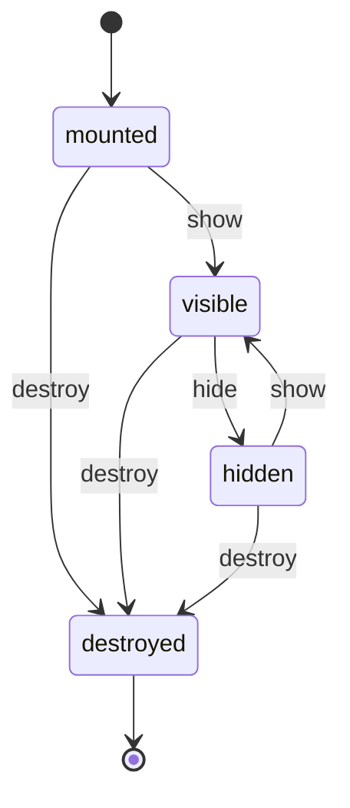
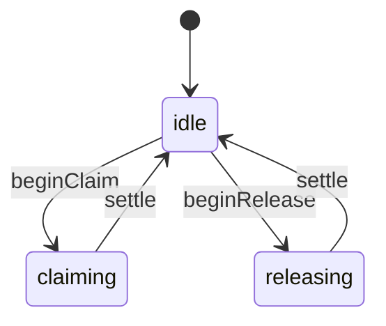
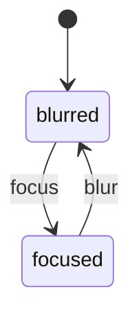

# windease

Browser-based window manager. One package, two entry points: a
framework-agnostic core (`windease`) and React bindings (`windease/react`).

```sh
npm install windease
```

React bindings peer-depend on `react@^19` (declared optional — install only
if you import from `windease/react`).

> **Playground:** every strategy and DnD path lives in the Ladle playground
> at <https://orochi235.github.io/windease/>.
>
> **API reference:** TypeDoc-generated reference at
> <https://orochi235.github.io/windease/api/>.

See [`docs/concepts.md`](docs/concepts.md) for the canonical vocabulary
(the capability model, which of the four state buckets owns what, how
`node.lock` restricts operations, and how reserved keys like `pinned` /
`size` interact with layout and DnD).

- **Node + capabilities, not classes.** Every node carries `lifecycle` and
  optionally `container` / `membership` / `focus`, all built by one
  constructor, `createNode`. The core enforces only structural invariants (no
  cycles, single focus, bidirectional links). `Panel` / `Zone` are convention
  names with shipped React presets, not built-in types; `Group` is the same
  shape reached via `createNode({ container, parentId })` and
  `<Zone parentId kind="group">`, not a separate preset.
- **Recursive containers** — any node with a `container` capability hosts
  children, and a child may itself be a container. "Tray inside a window"
  is just a panel whose `container` is set.
- **Universal lifecycle.** Every node carries an FSM
  (`mounted → visible ↔ hidden → destroyed`); panels additionally carry
  `transit` (atomic moves) and `focus` (single-focus invariant).
- **Record replacement.** Every store mutation produces a fresh `Node`
  reference; React's `useSyncExternalStore` invalidates correctly by
  default.
- **JSON-safe snapshots** via `serialize(store)` / `deserialize(snap)`.
- **Layout strategies** are pure functions. Built-ins: `gridStrategy` and
  `stripStrategy` (main-axis stack with capacity handling; `{ axis: 'y' }`
  is what "stack" was). Strategies work unchanged on recursive trees via the
  `LayoutNode` adapter. `store.split(id, input)` builds nested `stripStrategy`
  trees without a dedicated strategy of its own.

## Quick start

```bash
npm install windease
```

```tsx
import { gridStrategy } from 'windease';
import {
  Provider,
  StrategyRegistryProvider,
  Zone,
  Panel,
} from 'windease/react';

export function App() {
  return (
    <Provider>
      <StrategyRegistryProvider strategies={{ grid: gridStrategy }}>
        <Zone
          id="root"
          strategyId="grid"
          config={{ cols: 2 }}
          viewport={{ w: 720, h: 480 }}
        >
          <Panel id="a" meta={{ title: 'A' }} />
          <Panel id="b" meta={{ title: 'B' }} order={10} />
        </Zone>
      </StrategyRegistryProvider>
    </Provider>
  );
}
```

`<Panel>` / `<Zone>` register themselves with the underlying store on mount
and unregister on unmount. JSX is the source of truth for the shape of the
tree.

Import the baseline stylesheet once at the top of your app:

```ts
import 'windease/styles.css';
```

It supplies the structural rules `.windease-zone`, `.windease-window`, and
the insertion-line affordance default. All visual styling is yours.

### Imperative API (advanced / dynamic trees)

For server-loaded layouts, programmatically generated nodes, or anything
that can't be expressed as static JSX, use the store directly:

```tsx
import { Store, createNode, asNodeId } from 'windease';

const store = new Store();
store.registerNode(createNode({ id: asNodeId('p1'), parentId: asNodeId('root'), focus: true }));

<Provider store={store}>{/* ... */}</Provider>
```

Imperative and declarative nodes coexist under the same parent. JSX-owned
ids reconcile their props on every render; imperative ids retain whatever
the caller set. See `docs/concepts.md` for the ownership model.

## State machines

Every node carries up to three FSMs, all defined in `src/machines/` and run
through a tiny `Machine<State, Event>` runtime in `src/fsm.ts`. Snapshots
serialize the current state name; deserialize rebuilds a fresh machine
in that state.

**Lifecycle** (every node). Drives `node.lifecycle.state`. `show` / `hide`
are idempotent on their target state; `destroy` is terminal.


```mermaid
stateDiagram-v2
    [*] --> mounted
    mounted --> visible: show
    mounted --> destroyed: destroy
    visible --> hidden: hide
    hidden --> visible: show
    visible --> destroyed: destroy
    hidden --> destroyed: destroy
    destroyed --> [*]
```

**Transit** (parented nodes during `moveNode`). Provides an atomic
release-then-claim envelope around reparenting so transition listeners
can stage CSS/animation around the move. `settle` returns to `idle`.


```mermaid
stateDiagram-v2
    [*] --> idle
    idle --> claiming: beginClaim
    idle --> releasing: beginRelease
    claiming --> idle: settle
    releasing --> idle: settle
```

**Focus** (nodes that opt into the focus capability). Enforces the
single-focus invariant per store: focusing one node automatically blurs
the previous focus holder.


```mermaid
stateDiagram-v2
    [*] --> blurred
    blurred --> focused: focus
    focused --> blurred: blur
```

## Who owns child order

`<Zone>` reconciles its children's order from JSX child order on every render.
That is what you want when the declared order *is* the truth, and wrong when
the user rearranges things — a drop is reverted by the host's next render.

Pass `preserveStoreOrder` to make declared order *initial* rather than
authoritative:

```tsx
import { preserveStoreOrder } from 'windease/react';

<Zone id={zoneId} sort={preserveStoreOrder}>
  {workspaces.map((w) => (
    <Panel key={w.id} id={w.id} />
  ))}
</Zone>
```

The host still decides which children exist; the store decides how they are
arranged. Reconcile short-circuits, so no `setChildOrder` runs — you do not
need an `arrange` lock, and you do not need to echo `node.reordered` back into
your own state to keep the two in sync.

Write your own `ChildSort` for anything in between: it receives the observed
children with their `order` hints plus the current store order, and returns the
final list.

### When the host owns order outright

`preserveStoreOrder` keeps a drop without telling you about it. If your own
store is the authority — an app that already persists a workspace list and its
order — pass `onChildOrderChange` instead. A drop then calls you with the order
it *would* have produced and writes nothing:

```tsx
<Container
  parentId={zoneId}
  chrome={chrome}
  onChildOrderChange={(next, { movedId, fromParentId, toParentId }) => {
    myStore.setWorkspaceOrder(next); // your state, your persistence
  }}
/>
```

Commit it and re-render; the binding reconciles to whatever you declare next.
Two things to know:

- **Controlled means the store is not written at all.** If either side of a
  cross-parent drop is controlled, `moveNode` does not run and each controlled
  parent gets its own call. Moving the record — including into an uncontrolled
  zone — is yours, because committing here *and* asking you to commit would
  apply one gesture twice.
- **Only library-mediated gestures are intercepted.** `store.reorderInParent`
  and `store.moveNode` called directly still commit; that is you acting on your
  own store, not a user gesture to approve.

## Sizing a pane to its contents

Declare it per axis and the library measures for you:

```tsx
store.registerNode(
  createNode({ kind: 'palette', id, parentId: dockId, hints: { sizing: { h: 'content' } } }),
);
```

The presets take the same thing as a prop — `<Panel hints={{ sizing: { h: 'content' } }} />`
— reconciled on change like `meta`.

`<Container>` and the presets wrap a content-sized pane's children in an
auto-height div and observe it, so the measurement is of the content rather than of the extent the
layout just wrote — measuring the positioned wrapper would measure the library's
own output and never settle. Give that div's contents a real intrinsic height:
a child stretched with `height: 100%` reports the pane, not the content.

A measurement is a stated size like any other. It scales under pressure, it is
capped by `hints.maxSize`, and it loses to `placement.size` — so **dragging a
gutter pins the pane** and it stops tracking its contents. Clear the size to
resume:

```tsx
store.patchPlacement(id, { size: { h: undefined } });
```

Unlike a size you write, a measurement *is* floored at `hints.minSize`: the
exemption that makes the collapse pattern below work exists for deliberate
intent, and a measurement states none.

Without React, report measurements yourself — `hints.sizing` is honored by the
strategy either way:

```ts
host.setNaturalSize(id, { w, h }); // or host.observeNatural(id, el)
```

## Collapsing a pane

There is no collapse state. A collapsed pane is a sized pane: write
`placement.size` down to your header extent, and write it back to expand.

```tsx
const HEADER = 32;

const collapse = (id: NodeId) =>
  store.transact(() => {
    const h = (store.getNode(id)?.membership?.placement?.size as { h?: number })?.h;
    store.setMeta(id, { expandedH: h });
    store.patchPlacement(id, { size: { h: HEADER } });
  }, 'collapse');

const expand = (id: NodeId) =>
  store.transact(() => {
    const h = store.getNode(id)?.meta?.expandedH as number | undefined;
    store.patchPlacement(id, { size: { h } });
    store.setMeta(id, { expandedH: undefined });
  }, 'expand');
```

`transact` makes each one a single undo step, and `meta` round-trips through
`serialize`, so a collapsed layout survives save and reload.

`hints.minSize` does not block this. It floors a pane that states no size of
its own, and it still stops a gutter drag from crossing it — but a size you
write is taken as intent and rendered as written. So a palette can declare a
120px minimum for its expanded state and still collapse to a 32px header.

Two things the pattern owes its users: keep the collapsed pane's accessible
name, and keep its expand control reachable from the keyboard in whatever
still renders. A pane that can be collapsed and not reopened without a mouse
is worse than one that never collapsed.

## Collapsing a group that empties out

A group that started with two panes and lost one is a wrapper around nothing:
one child, one extra layout level, one extra level of nesting in every
snapshot. `store.setAutoUnsplit(groupId, true)` collapses it when that
happens — the survivor is lifted into the grandparent at the group's index,
inheriting the group's placement and pinned position, and the group is
destroyed.

```ts
store.setAutoUnsplit(groupId, true);
store.unregisterNode(paneA); // paneB takes the group's place; the group is gone
```

Opt-in per container, because a zone you created on purpose has to survive
being emptied — the trigger cannot live in `unregisterNode` itself. It fires
only on the transition, not on any container that happens to hold one child,
so you can still build a group up a pane at a time. A root never collapses:
there is no grandparent to lift into. And a `destroy` or `dragOut` lock on the
group, or `arrange` on its parent, quietly leaves the tree alone rather than
failing the removal that triggered it.

It does not cascade, and does not need to: lifting the survivor swaps it for
the group in the grandparent, so the grandparent's child count is unchanged.

Removals are now bracketed in a transaction so the collapse is one undo step
with the removal that caused it. If you bracket history on `transaction.begin`
/ `transaction.end`, every `unregisterNode` emits that pair, collapse or not.

## When panes don't fit

A strip whose panes ask for more than the container has resolves it three ways,
set by `overflowMode` on the zone's config.

`'squeeze'` (default) scales the panes down until their floors bind, then
reports whatever is left over as `LayoutResult.overflow`. This is what the
strategy has always done.

`'scroll'` lays out at the extent the panes asked for and reports the whole
excess. `<Container>` / `<Zone>` / `<Panel>` size their box to
`viewport + overflow`, so all you supply is a wrapper that scrolls:

```tsx
<div className="dock-scroll">           {/* overflow-y: auto */}
  <Zone id={dockId} strategyId="strip" config={{ axis: 'y', overflowMode: 'scroll' }}>
    <Panel id={a} hints={{ sizing: { h: 'content' } }} />
    <Panel id={b} hints={{ sizing: { h: 'content' } }} />
  </Zone>
</div>
```

Content-sized panes are the reason this mode is worth having, and the reason to
be careful with the other one. A measurement is a stated size, so under
`squeeze` a pane with no `hints.minSize` has nothing to floor it: it shrinks
below what it measured and `overflow` stays absent, because nothing bound.
Under `scroll` each pane holds at its measurement.

`'unplace'` places what fits at full extent and routes the rest to
`LayoutResult.unplaced`, which is also where `maxItems` sends items over its
count cap — the two compose. When even the first pane doesn't fit it is placed
anyway, clamped to the container, so an overflowing dock never renders empty.

`overflow` is reported per axis and absent when the content fits, so a consumer
that wants to drive its own policy can read it and ignore all three.

## Canvas hosts

A host that draws every pane into one canvas — scissor rects on a single WebGL
context, say — positions from placements instead of mounting an element per
node. Two things it needs that a DOM host does not.

`.windease-zone` clips its children. Add `.windease-zone--unclipped` to keep the
positioning and the container queries and drop the `overflow: hidden`, so one
canvas can span the whole zone.

Placements are in CSS pixels, which is most of what a backing store needs — but
a `devicePixelRatio` change means every canvas has to be resized, and dragging a
window between displays is the common case:

```ts
const stop = observePixelRatio((dpr) => resizeBackingStores(dpr));
```

It reports the current ratio immediately and again on every change, so one
handler covers mount and update. A resolution media query embeds the ratio it
was built with, so a listener left on it fires once and is then permanently
false; this re-arms at the new ratio each time.

It is not on `ContainerHost` on purpose: nothing in `layout()` reads the ratio,
and a ratio change and a placement change are independent triggers for the same
resize.

## Drag and drop

DnD is opt-in. Wrap your panel chrome in `<DragHandle>`, register each
container as a drop target with `useDropTarget(zoneId, ref)`, and put
the tree under `<DragProvider>`. The drag controller honors:

- `lock.move` on the source — per-node drag suppression.
- `lock.dragOut` on the source's parent — zone-level drag suppression.
- `lock.accept` on the target — zone-level drop refusal.
- The destination strategy's `canAccept(prospective-items, options)` — e.g.
  a strategy with a `maxItems` config refusing a drop that would overflow it.
- An optional consumer-supplied `canAccept(sourceId)` on the drop target.

See the **Parallel zones / Drag between** story for the canonical setup.

A host that isn't driving DOM elements — a canvas surface, a test — drives
`DragEngine` instead. It owns the same ownership, acceptance and hit-test
logic, but takes geometry as data and never binds a listener:

```ts
const engine = new DragEngine(store);
engine.addDropTarget(zoneId, { bounds: () => ({ x: 0, y: 0, w: 400, h: 300 }) });
engine.tryBegin(panelId);
engine.updateHoverByPoint(x, y);
engine.drop();
```

`DragController` is that engine plus the DOM: element rects, `parentElement`
depth for innermost-wins, the `data-drop-target` / `data-drop-rejected`
attributes, the window-level Escape and pointerup safety nets, and per-frame
coalescing of pointer samples. Samples run where they are made unless you pass
a `schedule`.

## Resize

Pass `affordances` to `<Container>`, `<Zone>` or `<Panel container={...}>` to
render `stripStrategy`'s interactive gutters — `resize-x-<childId>` / `resize-y-<childId>`, one after every
non-last child. Dragging one writes an explicit pixel size straight to
`membership.placement.size`, which round-trips through snapshot/hydrate as an
ordinary node field — no separate strategy state. Per-child `hints.minSize`
is honored as a pixel floor so manual gutter drags can't push a panel below
its declared minimum, and `hints.maxSize` as a ceiling so a pane can't grow
past it (on initial layout, explicit sizing, and gutter drags). The default
4px gutter ships with an 8px-wide hit area (`affordanceHitPad`).

To pin a pane to a fixed pixel extent along strip's main axis, set
`placement.size` via `store.patchPlacement(id, { size: { w } })` (or `{ h }`);
siblings without an explicit size of their own share the remainder. Combine
with `hints.maxSize` for an "auto up to a cap" pane. `store.split(id, input)`
builds the nested `stripStrategy` groups a multi-pane layout needs; see
`docs/concepts.md`.

A seam drag writes `placement.size` to the store. If you declare `placement`
on a preset instead, **you** own it: the prop is reconciled on every render, so
a drag would be reverted on the next one. Say so with `onPlacementChange` and
the gesture hands you the bag it would have written, leaving the store alone:

```tsx
const [h, setH] = useState(200);

<Panel id={a} placement={{ size: { h } }} onPlacementChange={(next) => setH(next.size.h)} />
<Panel id={b} />  {/* uncontrolled — its own drags commit as usual */}
```

Controlled and uncontrolled panes mix freely in one row. Without React, the
same thing is `host.registerPlacementControl(id, commit)`.

Gutters are operable from the keyboard. Each renders as `role="separator"`
carrying `aria-orientation` and `aria-valuenow` / `aria-valuemin` /
`aria-valuemax`, named after the panes it moves. Arrow keys along its
orientation step by `affordanceKeyStep` (8px by default) and `Home` / `End`
jump to the reported bounds; the perpendicular arrows are left alone so pane
navigation still works while a gutter holds focus.

Every gutter is a tab stop, which is the WAI-ARIA window-splitter pattern and
gets tiring in a dock of many panes — `affordanceTabStops={false}` keeps the
ARIA and drops the stops.

Under `resizeMode: 'neighbor'` a step is bounded by the pair, so a pane can
stop moving because its *neighbor* hit a limit while it is nowhere near its
own. `aria-valuenow` reflects where it actually landed; nothing is narrated to
a live region.

### Grid seams

`gridStrategy` takes `resizable: true` and emits the same affordances, except
they write `placement.span` — **cell counts, not pixels**, so an extent moves a
whole cell at a time and `aria-valuenow` reads as a column or row count. A
keyboard press moves exactly one cell, because the affordance reports its own
`bounds.step` rather than taking the container's pixel default.

```tsx
<Zone id={zoneId} strategy="grid" config={{ resizable: true }} />
```

A grid packs rather than pairing, so there is no one neighbor a seam trades
with: growing an item costs whoever no longer fits. The reported maximum is
therefore the largest span at which every sibling is still placed — in a grid
with no `maxRows`, that means it grows a row rather than dropping anyone.

A seam appears wherever a span can move in either direction, including on an
item already spanning to the edge, so a grown item can always be brought back.
`span` is gated by `lock.resize` exactly as `size` is.

## Keyboard navigation

Wrap the tree in two providers to make the layout reachable by keyboard.
`<GeometryProvider>` collects each pane's absolute rect so navigation can be
resolved by position; `<FocusProvider>` owns the tab stop, the keymap, and the
round-trip between DOM focus and `store.focusedId`.

```tsx
<Provider store={store}>
  <StrategyRegistryProvider strategies={STRATEGIES}>
    <GeometryProvider>
      <FocusProvider>
        <Container parentId={ROOT} chrome={chrome} />
      </FocusProvider>
    </GeometryProvider>
  </StrategyRegistryProvider>
</Provider>
```

`FocusProvider` renders one wrapper element with `display: contents`, so it
takes no layout box — but it needs `@windease/react/styles.css` imported for
that rule.

**The whole layout costs one Tab stop.** Exactly one pane wrapper carries
`tabIndex 0` — the focused one, or the first navigable pane when nothing is
focused yet — and the rest are `-1`. Tab moves *past* the layout, not through
it. windease never intercepts Tab: panes hold forms, editors and third-party
widgets that need it.

| Key | Moves | Active when |
| --- | --- | --- |
| `ArrowLeft` / `Right` / `Up` / `Down` | to the nearest pane in that direction | the pane wrapper itself has focus |
| `Home` / `End` | to the first / last sibling pane | the pane wrapper itself has focus |
| `F6` / `Shift+F6` | to the next / previous pane in the whole tree, wrapping | anywhere, including inside pane content |
| `Shift` + an arrow | the pane itself, into the slot that arrow points at | the pane wrapper itself has focus |

Arrows only act when the wrapper itself is the event target, so pressing Left
in a text input moves the caret rather than navigating away mid-word. F6 is
the escape hatch out of content that swallows the arrows.

### Moving a pane without a pointer

`Shift` plus an arrow rearranges rather than navigates. The pane takes the
slot of whatever that arrow would have moved the caret to — a reorder when
that node is a sibling, a reparent when it lives in another container — so
the same resolution backs both gestures, `navigate?` overrides included.

Focus rides along with the pane, and the move announces itself through the
live region below. A move that cannot happen does nothing at all: the key is
inert at the edge of the tree, on a `move`-locked pane, into an
`accept`-locked container, out of a `dragOut`-locked one, inside an
`arrange`-locked parent, or anywhere that would put a node inside itself.

`resolveMove` and `applyMove` are exported for a host that would rather bind
its own keys or offer a menu command:

```ts
const plan = resolveMove({ store, from: store.focusedId, direction: 'right', geometry });
if (plan) applyMove(store, plan);
```

`resolveMove` returns `null` for every refusal above rather than throwing, so
a caller can gray out a command by asking for its plan first.

Panes are named for screen readers by `meta.title`, falling back to kind plus
sibling index. A layout with more than a couple of panes should set titles.

Directional moves compare pane rectangles. A strategy that knows better can
say so by implementing `navigate?` — return an id to win, `undefined` to fall
through to the geometric search, `null` to declare that direction dead.

When the focused pane is destroyed or hidden, the store picks a successor
rather than dropping focus to the document, and reports the choice on
`focus.successor` with a `reason` of `destroyed` or `hidden`. `to` is null
only when nothing focusable is left.

### Announcements

Moving focus announces the new pane's name for free. What needs saying out
loud is a change that moves *no* focus: the focused pane closing, or being
relocated under a different parent. `FocusProvider` renders a polite live
region for those and speaks them — "Editor closed", "Editor moved to Sidebar,
position 2 of 3". Pass `announce={false}` for a host that owns its own live
region.

Only changes to the focused pane, or to a subtree focus sits inside, are
spoken; a host relocating thirty panes the user is not in narrates nothing.

A non-DOM host wires the same policy to its own output with `bindAnnouncer`,
which composes the text from the store and hands it to a `FocusAdapter`:

```ts
const off = bindAnnouncer(store, {
  present: (id) => surface.drawFocusRing(id),
  announce: (text) => surface.liveRegion.say(text),
});
```

## Optional transition throttling

Consumers driving the store from a live event stream can rate-limit how
fast the layout reacts. All of it is opt-in — omit `throttle` and the
store behaves exactly as it always has.

```ts
const store = new Store({
  throttle: {
    notifyMs: 32,                     // coalesce bursts into one flush
    dwell: { lifecycle: 150 },        // min quiet time before a state publishes
    stagger: { batch: 8, ms: 40 },    // publish mass transitions in waves
  },
});
```

Throttling gates **observation, never truth**. `getNode()` returns the
published view that subscribers and the React layer see; `getNodeTruth()`,
`nodesTruth`, `rootIdsTruth`, and `focusedIdTruth` return the exact current
state. Snapshot and history always read truth, so persistence and undo are
unaffected. `store.flushNow()` publishes everything pending immediately,
bypassing `notifyMs`, `dwell`, and `stagger` alike.

`notifyMs` coalesces bursts into one flush per window. `dwell` is a
debounce, not a leading-edge throttle: a node publishes once it has been
quiet for `dwellMs`, or when `maxWaitMs` has elapsed since it first went
dirty — the starvation cap that stops a permanently-noisy node from never
updating (defaults to 4x the largest configured dwell). Only an FSM
transition on a configured machine starts or restarts a dwell; ordinary
field writes (activity, placement, meta) never gate on it. `stagger`
publishes at most `batch` newly-eligible nodes per `ms`-spaced wave,
oldest-dirty-first, so a mass transition (e.g. a cold-start flood) animates
in deterministic batches instead of all at once.

### Introspecting what's withheld

`store.getPending(id)` answers "why hasn't this node published yet?":

```ts
const pending = store.getPending(nodeId);
// null if nothing is withheld for this id (always null on a
// store with no `throttle` policy)
if (pending) {
  const { since, touched, dwellMs, machine, bypass, coalesced, eligibleAt } = pending;
  // ...
}
```

`eligibleAt` is when the dwell/`maxWaitMs` gate *opens*, not when the node
will actually publish — `notifyMs` coalescing and stagger waves can both
defer the real flush past it. `coalesced` counts internal dirty-marks, not
store operations — it's a churn indicator, not a change tally.

Two paired events on `store.events` mark the same episode's edges:

```ts
store.events.on('throttle.pending', ({ id, since }) => { ... });
store.events.on('throttle.published', ({ id, heldMs, coalesced, forced }) => { ... });
```

Here too, `coalesced` is the number of internal dirty-marks folded into
this publish, not a count of store operations.

`throttle.pending` fires when a node first goes dirty, before the dwell
gate has settled, so it carries no `dwellMs`/`eligibleAt` — read
`getPending` for those. Exactly one `throttle.published` follows each
`throttle.pending` for the same id, including a node unregistered while
pending or dropped by `deserialize`, so a consumer maintaining a
`Set<NodeId>` of withheld nodes is correct at every point, not merely
balanced at the end.

Set `WINDEASE_TRACE=throttle` to see publish decisions.

A nonsensical policy (a negative or `NaN` `notifyMs`/`dwell`/`maxWaitMs`, a
`stagger.batch` below 1, or a negative `stagger.ms`) throws
`InvalidThrottlePolicyError` when the store is constructed, rather than
silently misbehaving. `notifyMs: 0` and `maxWaitMs: 0` are legal, meaningful
values, not omissions.

### Hydrating in place

`deserialize(snap)` builds a brand-new `Store` with default options — handy
for a one-shot load, but it drops whatever `throttle` policy you configured
and leaves existing subscribers pointed at the old instance. To rehydrate
an existing store instead (preserving its throttle policy and subscribers),
pass the store as the first argument:

```ts
deserialize(store, snap);
```

This clears the target in place before repopulating it, emitting
`node.unregistered` / `node.cascadeDestroyed` for whatever was there
before the snapshot lands.

### Saving one subtree

`serialize(store, { root })` captures a node and its descendants; `graft`
attaches that snapshot under a parent. Useful when your app's saved unit is
one workspace rather than the whole session.

```ts
const saved = serialize(store, { root: workspaceId });
store.unregisterNode(workspaceId);

// …later, possibly in a different store
graft(store, saved, dockId, { at: 0 });
```

Every id in the snapshot must be absent from the target store; a collision
throws `DuplicateNodeError` before anything is mutated. The subtree root's
placement travels with it. Focus does not move — call `focusNode` yourself if
the arriving subtree should take it.

## Breaking changes

### Unreleased — strategies may declare their config keys

`LayoutStrategy.configSpec` is new and optional. A strategy that declares the
keys it understands gets typos in `container.config` reported as `layout`
traces — an unknown key (with the nearest real one named), a value outside an
enum, a string where a number belongs — instead of silently taking the
default. `strip` and `grid` declare one; a strategy without one is not
checked, so nothing changes for third-party strategies until they opt in.

`checkStrategyConfig(name, config, spec)` is exported for hosts that would
rather assert on config in their own tests than read traces.

### Unreleased — `lock.arrange` applies to any node

`arrange` used to be dropped from the lock set of a node with no container,
which made it bind on every call that rearranges children *except*
`ensureContainer` — the one that decides whether a node gets children at all.
`setLock(panel, { arrange: true })` stored nothing and the panel could still
gain a container.

It is now supported on every node, alongside `destroy`. Two consequences:
`setLock(id, true)` and `createNode({ lock: true })` resolve to a set
including `arrange: true` on a leaf, and that axis is in the snapshot. If you
assert on an exact `LockSet`, update the expectation.

### 1.2.0 — `hasFocus` deprecated in favor of `canFocus`

Not breaking yet: `store.hasFocus(id)` still works and delegates. It is
removed at 2.0.0, so rename your call sites.

The method answers "does this node have a focus machine", the same shape as
`isContainer` / `isMember`. But it sat one method away from `focusedId`, and
`hasFocus(x) === false` reads as "x is not focused" — which it does not mean.
Two separate workstreams building on focus misread it. For the state, compare
`store.focusedId`.

### 1.0.1

`createZone` and `createPanel` are collapsed into one constructor,
`createNode`. The split was arbitrary: a zone with a `parentId` was already
what the removed `createGroup` built, and a panel with a `container` was
already the documented recursive-panel case. `container`, `membership` (via
`parentId`), and `focus` are now independent opt-in fields on one input.

| Removed | Use instead |
|---|---|
| `createZone`, `CreateZoneInput` | `createNode` |
| `createPanel`, `CreatePanelInput` | `createNode` |

Two mechanical rewrites cover every call site:

```ts
// createPanel({ id, parentId, ...rest }) →
createNode({ id, parentId, focus: true, ...rest });

// createZone({ id, strategyId, config, allowsPinning, ...rest }) →
createNode({ id, container: { strategyId, config, allowsPinning }, ...rest });
```

`<Zone>` and `<Panel>` are unchanged — they're React presets over
`createNode` now, but their props and behavior are the same.

### 1.0.0

Breaking. Three exports are removed; each has a direct replacement.

| Removed | Use instead |
|---|---|
| `splitStrategy` (+ `SplitNode`, `SplitOptions`, `SplitMeta`) | `store.split(id, input)` |
| `stackStrategy` | `stripStrategy` with `{ axis: 'y', fill: true }` |
| `createGroup`, `<Group>` | `createZone({ parentId })`, `<Zone parentId kind="group">` |

- **`store.split(id, input)` / `store.unsplit(groupId)`.** Split is a verb over
  the node tree rather than a strategy holding its own tree, so registering a
  child, removing one, and dragging one all behave — they are ordinary store
  mutations now. Directions are `'x'`, `'y'`, `'both'` and `'grid'`; all ids are
  caller-supplied.
- **`store.transact(fn, label?)`** emits `transaction.begin` /
  `transaction.end`. Bracket history pushes on that pair to get one undo step
  per composite operation — the `node.*` events are per-mutation and would give
  you one entry per node touched.
- **Snapshots are v5.** A v4 snapshot using `splitStrategy` migrates on read:
  its `SplitNode` tree becomes real nested strip groups. Pane *ratios* do not
  survive — strip derives extents from `placement.size` and hints, and a ratio
  has no equivalent — so a migrated layout comes back evenly divided.
- **Migrating `stackStrategy` requires the `fill: true`.** Strip's default is
  off, which sizes a child with no `preferredSize` to zero. That difference
  between the two strategies is why they were folded together.

### 0.9.0 — `node.lock` added, `pinned` redefined

`node.lock` is a new node-intrinsic `LockSet` restricting what may be done to
a node — see `docs/concepts.md` for the axis table. `membership.placement.pinned`
changes from a boolean (promote to the front of `childOrder`) to a number
(hold that exact index).

- `setAllowsDrop` / `setAllowsDragOut` are removed. Use
  `store.setLock(id, { accept: true })` and `{ dragOut: true }`.
- `membership.placement.locked` is no longer read. Use `store.setLock(id, ...)`,
  which is node-intrinsic and survives `moveNode`.
- `membership.placement.pinned` is a number (the held index), not a boolean,
  and can no longer be written through `patchPlacement` / `setPlacement` —
  both throw. Use `store.setPinned(id, at?)` / `store.unpin(id)`.
- Locking no longer reorders. Previously `locked` implied promotion to the
  front of the parent's `childOrder`; a locked node now stays exactly where
  it is.
- `container.allowsDropChanged` / `container.allowsDragOutChanged` are
  replaced by `node.lockChanged` and `node.pinnedChanged`.
- Snapshots are v4. `deserialize` still accepts v2 and v3 and migrates on
  read.

### 0.9.0 — `slot` renamed to `membership`

The parent-membership capability is now `node.membership`, not `node.slot`.
"Slot" was borrowed from web components, where a slot is a hole the *parent*
exposes; here the capability hangs on the *child* and means "the position I
occupy in my parent," so the direction was inverted from what the word
implies everywhere else. `membership` is the word `docs/concepts.md` already
used in prose to describe the lifetime rule.

| Before | After |
| --- | --- |
| `node.slot` | `node.membership` |
| `SlotCap` | `MembershipCap` |
| `store.isSlotted(id)` | `store.isMember(id)` |
| `CapabilityMissingError.capability === 'slot'` | `=== 'membership'` |
| `InvariantViolationError` code `move-unslotted` | `move-unparented` |
| `InvariantViolationError` code `reorder-unslotted` | `reorder-unparented` |

**Snapshots migrate automatically.** `serialize()` now emits `version: 3`
with a `membership` key. `deserialize()` still accepts `version: 2`
snapshots and maps the old `slot` key across on read, so persisted state
from 0.8.0 and earlier keeps loading. Only the write side changed; there is
no migration step to run.

## Develop

```bash
npm install
npm test
npm run build
npm run lint
npm run ladle    # opens the playground at http://localhost:61000/
```

Design / planning docs live under `docs/superpowers/`. Canonical reference:
[`docs/concepts.md`](docs/concepts.md).
