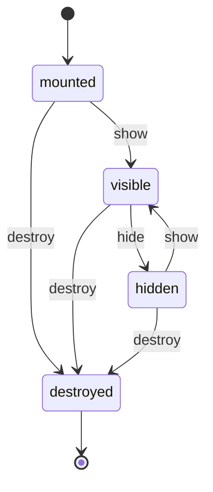
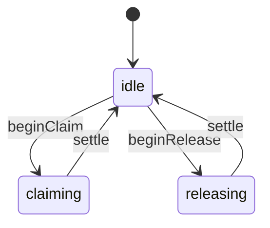
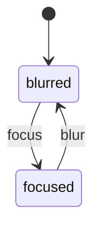

# windease

Browser-based window manager. One package, two entry points: a
framework-agnostic core (`windease`) and React bindings (`windease/react`).

```sh
npm install windease
```

React bindings peer-depend on `react@^19` (declared optional — install only
if you import from `windease/react`).

> **Playground:** every strategy and DnD path lives in the Ladle playground
> at <https://orochi235.github.io/windease/>.
>
> **API reference:** TypeDoc-generated reference at
> <https://orochi235.github.io/windease/api/>.

See [`docs/concepts.md`](docs/concepts.md) for the canonical vocabulary
(the capability model, which of the four state buckets owns what, and how
reserved keys like `pinned` / `locked` / `size` interact with layout and
DnD).

- **Node + capabilities, not classes.** Every node optionally carries
  `container` / `membership` / `focus` / `lifecycle`. The core enforces only
  structural invariants (no cycles, single focus, bidirectional links).
  `Panel` / `Group` / `Zone` are convention names with shipped presets,
  not built-in types.
- **Recursive containers** — any node with a `container` capability hosts
  children, and a child may itself be a container. "Tray inside a window"
  is just a panel whose `container` is set.
- **Universal lifecycle.** Every node carries an FSM
  (`mounted → visible ↔ hidden → destroyed`); panels additionally carry
  `transit` (atomic moves) and `focus` (single-focus invariant).
- **Record replacement.** Every store mutation produces a fresh `Node`
  reference; React's `useSyncExternalStore` invalidates correctly by
  default.
- **JSON-safe snapshots** via `serialize(store)` / `deserialize(snap)`.
- **Layout strategies** are pure functions. Built-ins: `gridStrategy`,
  `stackStrategy`, `stripStrategy`, `splitStrategy` (binary by default,
  recursive when `recursive: true` in config). Strategies work unchanged
  on recursive trees via the `LayoutNode` adapter.

## Quick start

```bash
npm install windease
```

```tsx
import { gridStrategy } from 'windease';
import {
  Provider,
  StrategyRegistryProvider,
  Zone,
  Panel,
} from 'windease/react';

export function App() {
  return (
    <Provider>
      <StrategyRegistryProvider strategies={{ grid: gridStrategy }}>
        <Zone
          id="root"
          strategyId="grid"
          config={{ cols: 2 }}
          viewport={{ w: 720, h: 480 }}
        >
          <Panel id="a" meta={{ title: 'A' }} />
          <Panel id="b" meta={{ title: 'B' }} order={10} />
        </Zone>
      </StrategyRegistryProvider>
    </Provider>
  );
}
```

`<Panel>` / `<Group>` / `<Zone>` register themselves with the underlying
store on mount and unregister on unmount. JSX is the source of truth for
the shape of the tree.

Import the baseline stylesheet once at the top of your app:

```ts
import 'windease/styles.css';
```

It supplies the structural rules `.windease-zone`, `.windease-window`, and
the insertion-line affordance default. All visual styling is yours.

### Imperative API (advanced / dynamic trees)

For server-loaded layouts, programmatically generated nodes, or anything
that can't be expressed as static JSX, use the store directly:

```tsx
import { Store, createPanel, asNodeId } from 'windease';

const store = new Store();
store.registerNode(createPanel({ id: asNodeId('p1'), parentId: asNodeId('root') }));

<Provider store={store}>{/* ... */}</Provider>
```

Imperative and declarative nodes coexist under the same parent. JSX-owned
ids reconcile their props on every render; imperative ids retain whatever
the caller set. See `docs/concepts.md` for the ownership model.

## State machines

Every node carries up to three FSMs, all defined in `src/machines/` and run
through a tiny `Machine<State, Event>` runtime in `src/fsm.ts`. Snapshots
serialize the current state name; deserialize rebuilds a fresh machine
in that state.

**Lifecycle** (every node). Drives `node.lifecycle.state`. `show` / `hide`
are idempotent on their target state; `destroy` is terminal.


```mermaid
stateDiagram-v2
    [*] --> mounted
    mounted --> visible: show
    mounted --> destroyed: destroy
    visible --> hidden: hide
    hidden --> visible: show
    visible --> destroyed: destroy
    hidden --> destroyed: destroy
    destroyed --> [*]
```

**Transit** (parented nodes during `moveNode`). Provides an atomic
release-then-claim envelope around reparenting so transition listeners
can stage CSS/animation around the move. `settle` returns to `idle`.


```mermaid
stateDiagram-v2
    [*] --> idle
    idle --> claiming: beginClaim
    idle --> releasing: beginRelease
    claiming --> idle: settle
    releasing --> idle: settle
```

**Focus** (nodes that opt into the focus capability). Enforces the
single-focus invariant per store: focusing one node automatically blurs
the previous focus holder.


```mermaid
stateDiagram-v2
    [*] --> blurred
    blurred --> focused: focus
    focused --> blurred: blur
```

## Drag and drop

DnD is opt-in. Wrap your panel chrome in `<DragHandle>`, register each
container as a drop target with `useDropTarget(zoneId, ref)`, and put
the tree under `<DragProvider>`. The drag controller honors:

- `membership.placement.locked` — per-child drag suppression.
- `container.allowsDragOut` — zone-level drag suppression.
- `container.allowsDrop` — zone-level drop refusal.
- The destination strategy's `canAccept(prospective-items, options)` — e.g.
  `splitStrategy` with `recursive: false` refuses anything that wouldn't
  leave exactly two children.
- An optional consumer-supplied `canAccept(sourceId)` on the drop target.

See the **Parallel zones / Drag between** story for the canonical setup.

## Resize

Pass `affordances` to `<Container>` to render the strategy's interactive
gutters. `splitStrategy` ships draggable gutters out of the box (binary
by default; pass `recursive: true` for arbitrary trees). State persists
on `node.container.state` and survives snapshot/hydrate. Per-child
`hints.minSize` is honored as a pixel floor so manual gutter drags can't
push a panel below its declared minimum, and `hints.maxSize` as a ceiling
so a pane can't grow past it (on initial layout, explicit sizing, and
gutter drags). The default 4px gutter ships with an 8px-wide hit area
(`affordanceHitPad`).

To pin a pane to a fixed pixel extent along the split's axis, set
`placement.size` via `store.patchPlacement(id, { size: { w } })` (or `{ h }`);
the sibling auto-takes the remainder, and a gutter drag clears it, reverting
that pane to ratio control. Combine with `hints.maxSize` for an
"auto up to a cap" pane.

## Optional transition throttling

Consumers driving the store from a live event stream can rate-limit how
fast the layout reacts. All of it is opt-in — omit `throttle` and the
store behaves exactly as it always has.

```ts
const store = new Store({
  throttle: {
    notifyMs: 32,                     // coalesce bursts into one flush
    dwell: { lifecycle: 150 },        // min quiet time before a state publishes
    stagger: { batch: 8, ms: 40 },    // publish mass transitions in waves
  },
});
```

Throttling gates **observation, never truth**. `getNode()` returns the
published view that subscribers and the React layer see; `getNodeTruth()`,
`nodesTruth`, `rootIdsTruth`, and `focusedIdTruth` return the exact current
state. Snapshot and history always read truth, so persistence and undo are
unaffected. `store.flushNow()` publishes everything pending immediately,
bypassing `notifyMs`, `dwell`, and `stagger` alike.

`notifyMs` coalesces bursts into one flush per window. `dwell` is a
debounce, not a leading-edge throttle: a node publishes once it has been
quiet for `dwellMs`, or when `maxWaitMs` has elapsed since it first went
dirty — the starvation cap that stops a permanently-noisy node from never
updating (defaults to 4x the largest configured dwell). Only an FSM
transition on a configured machine starts or restarts a dwell; ordinary
field writes (activity, placement, meta) never gate on it. `stagger`
publishes at most `batch` newly-eligible nodes per `ms`-spaced wave,
oldest-dirty-first, so a mass transition (e.g. a cold-start flood) animates
in deterministic batches instead of all at once.

### Introspecting what's withheld

`store.getPending(id)` answers "why hasn't this node published yet?":

```ts
const pending = store.getPending(nodeId);
// null if nothing is withheld for this id (always null on a
// store with no `throttle` policy)
if (pending) {
  const { since, touched, dwellMs, machine, bypass, coalesced, eligibleAt } = pending;
  // ...
}
```

`eligibleAt` is when the dwell/`maxWaitMs` gate *opens*, not when the node
will actually publish — `notifyMs` coalescing and stagger waves can both
defer the real flush past it. `coalesced` counts internal dirty-marks, not
store operations — it's a churn indicator, not a change tally.

Two paired events on `store.events` mark the same episode's edges:

```ts
store.events.on('throttle.pending', ({ id, since }) => { ... });
store.events.on('throttle.published', ({ id, heldMs, coalesced, forced }) => { ... });
```

Here too, `coalesced` is the number of internal dirty-marks folded into
this publish, not a count of store operations.

`throttle.pending` fires when a node first goes dirty, before the dwell
gate has settled, so it carries no `dwellMs`/`eligibleAt` — read
`getPending` for those. Exactly one `throttle.published` follows each
`throttle.pending` for the same id, including a node unregistered while
pending or dropped by `deserialize`, so a consumer maintaining a
`Set<NodeId>` of withheld nodes is correct at every point, not merely
balanced at the end.

Set `WINDEASE_TRACE=throttle` to see publish decisions.

A nonsensical policy (a negative or `NaN` `notifyMs`/`dwell`/`maxWaitMs`, a
`stagger.batch` below 1, or a negative `stagger.ms`) throws
`InvalidThrottlePolicyError` when the store is constructed, rather than
silently misbehaving. `notifyMs: 0` and `maxWaitMs: 0` are legal, meaningful
values, not omissions.

### Hydrating in place

`deserialize(snap)` builds a brand-new `Store` with default options — handy
for a one-shot load, but it drops whatever `throttle` policy you configured
and leaves existing subscribers pointed at the old instance. To rehydrate
an existing store instead (preserving its throttle policy and subscribers),
pass the store as the first argument:

```ts
deserialize(store, snap);
```

This clears the target in place before repopulating it, emitting
`node.unregistered` / `node.cascadeDestroyed` for whatever was there
before the snapshot lands.

## Breaking changes

### Unreleased — `slot` renamed to `membership`

The parent-membership capability is now `node.membership`, not `node.slot`.
"Slot" was borrowed from web components, where a slot is a hole the *parent*
exposes; here the capability hangs on the *child* and means "the position I
occupy in my parent," so the direction was inverted from what the word
implies everywhere else. `membership` is the word `docs/concepts.md` already
used in prose to describe the lifetime rule.

| Before | After |
| --- | --- |
| `node.slot` | `node.membership` |
| `SlotCap` | `MembershipCap` |
| `store.isSlotted(id)` | `store.isMember(id)` |
| `CapabilityMissingError.capability === 'slot'` | `=== 'membership'` |
| `InvariantViolationError` code `move-unslotted` | `move-unparented` |
| `InvariantViolationError` code `reorder-unslotted` | `reorder-unparented` |

**Snapshots migrate automatically.** `serialize()` now emits `version: 3`
with a `membership` key. `deserialize()` still accepts `version: 2`
snapshots and maps the old `slot` key across on read, so persisted state
from 0.8.0 and earlier keeps loading. Only the write side changed; there is
no migration step to run.

## Develop

```bash
npm install
npm test
npm run build
npm run lint
npm run ladle    # opens the playground at http://localhost:61000/
```

Design / planning docs live under `docs/superpowers/`. Canonical reference:
[`docs/concepts.md`](docs/concepts.md).
